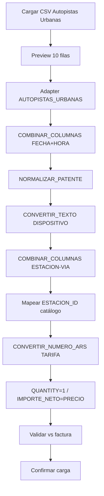

# Ejemplo — Autopistas Urbanas (CSV)

## 1. Objetivo del ejemplo

Este documento describe un segundo caso de proveedor, más simple que el [ejemplo MVP Demo](./ejemplo-mvp-procesamiento-pasadas.md), usando el archivo real:

```text
docs/plan/csv/autopistas_urbanas.csv
```

El objetivo es demostrar cómo el motor de transformaciones (skill `peajes-transformaciones-motor`) adapta columnas semánticamente similares con **algoritmos distintos** según el formato ya presente en el archivo:

1. Cargar el CSV (separador `;`).
2. Seleccionar columnas necesarias.
3. Aplicar un pipeline más corto (fecha/hora ya formateadas; sin bonificación).
4. Unir `ESTACION` + `VIA` para formar el código de estación del proveedor.
5. Relacionar ese código con el catálogo interno (estación → peaje).
6. Generar la estructura estandarizada.
7. Validar importes frente a factura (mock del ejemplo).

**Principio:** *el tipo semántico elige el patrón; el formato del proveedor elige el algoritmo atómico.*

---

## 2. Archivo de origen

| Propiedad | Valor |
|-----------|--------|
| Archivo | `autopistas_urbanas.csv` |
| Separador | `;` |
| Filas totales en archivo | `167` |
| Filas del ejemplo (preview) | primeras `10` |

Columnas del CSV:

```text
FECHA; HORA; ESTACION; VIA; DISPOSITIVO; PATENTE; CATEGORIA; TARIFA;
TIPO_DE_DOCUMENTO; DOCUMENTO_LEGAL; DOCUMENTO_SA; CLIENTE__WEB; CLIENTE_RED; SUB_CUENTA
```

Primeras 10 filas (resumen):

| # | FECHA | HORA | ESTACION | VIA | DISPOSITIVO | PATENTE | TARIFA |
|---|---|---|---|---|---|---|---|
| 1 | `2026-07-27` | `12:14:33` | `VAR` | `02C` | `99793212` | `AG507DK` | `19.985,09` |
| 2 | `2026-07-25` | `10:09:33` | `VAR` | `02P` | `97076009` | `AH185KI` | `19.985,09` |
| 3 | `2026-07-24` | `06:55:58` | `KDT` | `02P` | `99837024` | `AB456CU` | `7.918,73` |
| 4 | `2026-07-27` | `05:25:32` | `KDT` | `02C` | `98702170` | `AD625QB` | `7.918,73` |
| 5 | `2026-07-23` | `04:22:17` | `KDT` | `02C` | `97135819` | `AH351RT` | `7.918,73` |
| 6 | `2026-07-28` | `09:50:36` | `KDT` | `02C` | `94579785` | `AD482MT` | `22.247,33` |
| 7 | `2026-07-28` | `09:57:33` | `PB2` | `03S` | `94579785` | `AD482MT` | `13.015,92` |
| 8 | `2026-07-25` | `02:27:15` | `PB2` | `02S` | `93415947` | `AG893YR` | `13.015,92` |
| 9 | `2026-07-25` | `11:28:48` | `KDT` | `02C` | `94959936` | `AF103ZL` | `7.918,73` |
| 10 | `2026-07-22` | `10:57:09` | `PB2` | `02S` | `97164396` | `AH543IQ` | `13.015,92` |

---

## 3. Comparación con el ejemplo Demo (MVP)

| Aspecto | Demo (`pasadas_junio_2026`) | Autopistas Urbanas |
|---------|----------------------------|--------------------|
| Fecha | `25/06/2026` | Ya ISO `2026-07-27` |
| Hora | `205005` / `HHMMSS` (pad ceros) | Ya `HH:MM:SS` |
| Fecha+hora | Combinado `COMBINAR_FECHA_HORA` → `FORMATEAR_FECHA_HORA` | Solo **unir** con `COMBINAR_COLUMNAS` |
| Patente | `DOMINIO` → `NORMALIZAR_PATENTE` | `PATENTE` → **mismo** `NORMALIZAR_PATENTE` |
| Pase | `DISPOSITIVON` | `DISPOSITIVO` → `PASE_ID` |
| Estación | Solo `ESTACION` (código numérico) | `ESTACION` + `VIA` → código compuesto |
| Precio | Entero + `BONIFICACION` → `CALCULAR_IMPORTE_NETO` | Solo `TARIFA` (formato AR) → `CONVERTIR_NUMERO_ARS`; `IMPORTE_NETO = PRECIO` |
| Complejidad | Media | **Más simple** |

---

## 4. Selección de columnas

| Columna | Utilización |
|---------|-------------|
| `FECHA` | Parte de `FECHA_HORA` (ya formateada). |
| `HORA` | Parte de `FECHA_HORA` (ya formateada). |
| `ESTACION` | Con `VIA`, forma el código de estación del proveedor. |
| `VIA` | Con `ESTACION`, forma el código de estación del proveedor. |
| `DISPOSITIVO` | Se utiliza como `PASE_ID`. |
| `PATENTE` | Se utiliza como `PATENTE_ID`. |
| `TARIFA` | Se utiliza como `PRECIO` e `IMPORTE_NETO` (sin bonificación). |

Columnas ignoradas en la estructura estandarizada de este ejemplo:

| Columna | Tratamiento |
|---------|-------------|
| `CATEGORIA` | Ignorada hasta equivalencia interna. |
| `TIPO_DE_DOCUMENTO`, `DOCUMENTO_*`, `CLIENTE_*`, `SUB_CUENTA` | Metadatos de facturación/cuenta; fuera del Structure Goal de pasada. |

---

## 5. Mapeo de columnas

| Origen | Campo estandarizado | Transformación |
|--------|---------------------|----------------|
| `FECHA` + `HORA` | `FECHA_HORA` | Unir (ya válidos). |
| `PATENTE` | `PATENTE_ID` | Normalizar patente (pipeline genérico). |
| `DISPOSITIVO` | `PASE_ID` | Texto + trim. |
| `ESTACION` + `VIA` | código proveedor → `ESTACION_ID` | Combinar → buscar en catálogo. |
| `TARIFA` | `PRECIO` | Convertir número (formato `19.985,09`). |
| `PRECIO` | `IMPORTE_NETO` | Igual a precio (sin bonificación). |
| Valor generado | `QUANTITY` | `1`. |

---

## 6. Patrones del motor (`peajes-transformaciones-motor`)

Este ejemplo usa los **tres patrones** del skill:

| Patrón | Rol en Autopistas Urbanas |
|--------|---------------------------|
| **Adapter** | `AUTOPISTAS_URBANAS`: conoce headers (`PATENTE`, `DISPOSITIVO`, `VIA`) y formatos (ISO date, `HH:MM:SS`, moneda AR). |
| **Builder** | `PipelineBuilder` ordena pasos 10…60; valida columnas requeridas y `orden` único (RN-18). |
| **Strategy** | Cada paso atómico se resuelve en `StrategyRegistry` (RN-20). No se ejecuta código desde `jsonb`. |

### 6.1 Matriz semántica → algoritmos

| Tipo semántico | Señal en CSV | Algoritmo combinado / flujo | Códigos atómicos (`ALGORITMO_CODIGOS`) |
|----------------|--------------|-----------------------------|----------------------------------------|
| DateTime | `FECHA` ISO + `HORA` `HH:MM:SS` | Unir solamente | `COMBINAR_COLUMNAS` |
| Patente | `PATENTE` | `NORMALIZAR_PATENTE` *(combinado)* | `BORRAR_ESPACIOS` → `ELIMINAR_GUIONES` → `CONVERTIR_MAYUSCULAS` |
| Dispositivo / pase | `DISPOSITIVO` | Normalizar pase | `CONVERTIR_TEXTO` (o `COPIAR_COLUMNA` + trim) |
| Estación | `ESTACION` + `VIA` | Combinar código + mapeo catálogo | `COMBINAR_COLUMNAS` luego resolución de catálogo (Paso 5) |
| Moneda | `TARIFA` con `.` miles y `,` decimal | Formato número AR | `CONVERTIR_NUMERO_ARS` |
| Importe neto | = precio | Sin resta | `COPIAR_COLUMNA` desde `PRECIO` **o** `ASIGNAR_VALOR` no aplica; copiar resultado numérico |
| Cantidad | fila = 1 pasada | Valor fijo | `ASIGNAR_VALOR` `{ valor: 1 }` |

**Nota:** `NORMALIZAR_PATENTE` y nombres de plantilla no son códigos del registry; el combinado se expande a pasos atómicos (igual que en el ejemplo Demo).

---

## 7. Transformaciones paso a paso

### 7.1 FECHA_HORA — solo join

A diferencia del Demo, **no** hace falta `FORMATEAR_FECHA_HORA` ni pad de `HHMMSS`.

```text
FECHA = 2026-07-27
HORA  = 12:14:33
→ COMBINAR_COLUMNAS { columnas: ['FECHA','HORA'], separador: ' ' }
FECHA_HORA = 2026-07-27 12:14:33
```

Patrón: **Strategy** `COMBINAR_COLUMNAS`.

---

### 7.2 PATENTE_ID — mismo pipeline genérico que Demo

Igual que `DOMINIO` en el MVP:

```text
NORMALIZAR_PATENTE
  → BORRAR_ESPACIOS
  → ELIMINAR_GUIONES
  → CONVERTIR_MAYUSCULAS
```

Ejemplo: `" ag-507-dk "` → `AG507DK`.

Patrones: **Builder** (expande combinado) + **Strategy** (tres atómicos).

---

### 7.3 PASE_ID desde DISPOSITIVO

```text
DISPOSITIVO = 99793212
→ CONVERTIR_TEXTO
PASE_ID = 99793212
```

El mismo dispositivo puede repetirse en varias filas (válido).

---

### 7.4 Código de estación = ESTACION + VIA

```text
ESTACION = VAR
VIA      = 02C
→ COMBINAR_COLUMNAS { columnas: ['ESTACION','VIA'], separador: '-' }
CODIGO_PROVEEDOR = VAR-02C
→ (Paso 5 / catálogo) ESTACION_ID interno
```

Códigos distintos en las 10 filas del ejemplo: `VAR-02C`, `VAR-02P`, `KDT-02P`, `KDT-02C`, `PB2-03S`, `PB2-02S`.

Patrones: **Adapter** (define el separador y el uso de `VIA`) + **Strategy** `COMBINAR_COLUMNAS` + relación de catálogo (no es un código atómico del registry).

---

### 7.5 TARIFA → PRECIO (solo formato numérico)

```text
TARIFA = 19.985,09
→ CONVERTIR_NUMERO_ARS  (`19.985,09` → `19985.09`)
PRECIO = 19985.09
IMPORTE_NETO = 19985.09   # sin BONIFICACION en este proveedor
QUANTITY = 1
```

No se usa `CALCULAR_IMPORTE_NETO` (no hay columna de descuento).

---

### 7.6 Plantilla de configuración sugerida

| Campo | Valor |
|-------|--------|
| `nombre` | `Autopistas Urbanas - Pasadas` |
| `descripcion` | `Join fecha/hora, patente genérica, estación+vía, tarifa AR.` |
| `empresa_id` | (empresa del tenant) |
| `estado` | `activa` |
| `estrategia_codigo` | `AUTOPISTAS_URBANAS` |

| Orden | Destino / paso | Tipo | Algoritmo | Parámetros |
|------:|----------------|------|-----------|------------|
| 10 | `FECHA_HORA` | transformación | `COMBINAR_COLUMNAS` | `FECHA`, `HORA`, separador espacio |
| 20 | `PATENTE_ID` | transformación | `NORMALIZAR_PATENTE` *(combinado)* | igual Demo |
| 30 | `PASE_ID` | transformación | `CONVERTIR_TEXTO` | columna `DISPOSITIVO` |
| 40 | `CODIGO_ESTACION` | transformación | `COMBINAR_COLUMNAS` | `ESTACION`, `VIA`, separador `-` |
| 50 | `ESTACION_ID` | mapeo | catálogo / `codigos_proveedor` | match sobre `CODIGO_ESTACION` |
| 60 | `PRECIO` / `IMPORTE_NETO` | transformación | `CONVERTIR_NUMERO_ARS` | locale AR sobre `TARIFA` |
| 70 | `QUANTITY` | cálculo | `ASIGNAR_VALOR` | `{ valor: 1 }` |

Ejecución conceptual:

```text
PipelineBuilder
  .conConfiguraciones(...)
  .conAlgoritmos([NORMALIZAR_PATENTE, ...])
  .build()
→ StrategyRegistry.resolve(cada código atómico)
```

---

## 8. Catálogo ficticio de peajes / estaciones

Un peaje ficticio para el ejemplo:

| ID | NOMBRE |
|----|--------|
| `PEA-AU-001` | `Autopistas Urbanas Demo` |

Estaciones (código compuesto `ESTACION-VIA` → id interno):

| ID interno | Código proveedor | NOMBRE (ficticio) | PEAJE_ID |
|------------|------------------|-------------------|----------|
| `EST-AU-01` | `VAR-02C` | `VAR vía 02C` | `PEA-AU-001` |
| `EST-AU-02` | `VAR-02P` | `VAR vía 02P` | `PEA-AU-001` |
| `EST-AU-03` | `KDT-02P` | `KDT vía 02P` | `PEA-AU-001` |
| `EST-AU-04` | `KDT-02C` | `KDT vía 02C` | `PEA-AU-001` |
| `EST-AU-05` | `PB2-03S` | `PB2 vía 03S` | `PEA-AU-001` |
| `EST-AU-06` | `PB2-02S` | `PB2 vía 02S` | `PEA-AU-001` |

En persistencia real, esos códigos viven en `estaciones.codigos_proveedor` (array) o equivalencia documentada en el adapter.

---

## 9. Resultado estandarizado (10 filas)

| PASADA_ID | FECHA_HORA | PASE_ID | PATENTE_ID | ESTACION_ID | PRECIO | BONIFICACION | QUANTITY | IMPORTE_NETO |
|---|---|---|---|---|---:|---:|---:|---:|
| `PAS-AU-01` | `2026-07-27 12:14:33` | `99793212` | `AG507DK` | `EST-AU-01` | `19985.09` | `0` | `1` | `19985.09` |
| `PAS-AU-02` | `2026-07-25 10:09:33` | `97076009` | `AH185KI` | `EST-AU-02` | `19985.09` | `0` | `1` | `19985.09` |
| `PAS-AU-03` | `2026-07-24 06:55:58` | `99837024` | `AB456CU` | `EST-AU-03` | `7918.73` | `0` | `1` | `7918.73` |
| `PAS-AU-04` | `2026-07-27 05:25:32` | `98702170` | `AD625QB` | `EST-AU-04` | `7918.73` | `0` | `1` | `7918.73` |
| `PAS-AU-05` | `2026-07-23 04:22:17` | `97135819` | `AH351RT` | `EST-AU-04` | `7918.73` | `0` | `1` | `7918.73` |
| `PAS-AU-06` | `2026-07-28 09:50:36` | `94579785` | `AD482MT` | `EST-AU-04` | `22247.33` | `0` | `1` | `22247.33` |
| `PAS-AU-07` | `2026-07-28 09:57:33` | `94579785` | `AD482MT` | `EST-AU-05` | `13015.92` | `0` | `1` | `13015.92` |
| `PAS-AU-08` | `2026-07-25 02:27:15` | `93415947` | `AG893YR` | `EST-AU-06` | `13015.92` | `0` | `1` | `13015.92` |
| `PAS-AU-09` | `2026-07-25 11:28:48` | `94959936` | `AF103ZL` | `EST-AU-04` | `7918.73` | `0` | `1` | `7918.73` |
| `PAS-AU-10` | `2026-07-22 10:57:09` | `97164396` | `AH543IQ` | `EST-AU-06` | `13015.92` | `0` | `1` | `13015.92` |

Suma `IMPORTE_NETO` (10 filas) = **`132940.19`**.

---

## 10. Factura ficticia (validación del ejemplo)

| Campo | Valor |
|-------|--------|
| `FACTURA` | `F-AU-0001-00001001` |
| `CUENTA` | `CTA-AU-001` |
| `EMPRESA` | `Autopistas Urbanas Demo` |
| `Fecha_factura` | `2026-07-31` |
| `Importe_SIN_IVA` | `132940.19` |
| `Importe_Total` | (mock; IVA no es criterio del MVP de pasadas) |

| Concepto | Importe |
|----------|--------:|
| Suma `IMPORTE_NETO` | `132940.19` |
| `Importe_SIN_IVA` | `132940.19` |
| Diferencia | `0.00` |
| Estado | `Válido` |

---

## 11. Resumen del procesamiento (10 filas)

| Indicador | Resultado |
|-----------|----------:|
| Registros del preview | `10` |
| Válidos | `10` |
| Rechazados | `0` |
| Códigos estación distintos | `6` |
| Peajes | `1` |
| Importe neto total | `132940.19` |

El pase `94579785` / patente `AD482MT` aparece dos veces (filas 6 y 7) en estaciones distintas: válido (RN-16 usa también `fecha_hora` + `estacion_id`).

---

## 12. Flujo



---

## 13. Criterios de aceptación

El caso se considera exitoso cuando:

- Se procesan las 10 filas de preview sin rechazo.
- `FECHA_HORA` se obtiene solo uniendo `FECHA` y `HORA` (sin pad `HHMMSS`).
- `PATENTE` usa el mismo combinado `NORMALIZAR_PATENTE` que el Demo.
- `DISPOSITIVO` → `PASE_ID`.
- `ESTACION`+`VIA` → código `ESTACION-VIA` y match de catálogo.
- `TARIFA` parsea formato AR a decimal; `IMPORTE_NETO = PRECIO`.
- `QUANTITY = 1` en cada fila.
- Suma de importes netos = `132940.19` = `Importe_SIN_IVA` de la factura de ejemplo.
- El pipeline se construye con `PipelineBuilder` y solo códigos registrados en `StrategyRegistry`.

---

## 14. Referencias

- Archivo: [csv/autopistas_urbanas.csv](./csv/autopistas_urbanas.csv)
- Ejemplo Demo: [ejemplo-mvp-procesamiento-pasadas.md](./ejemplo-mvp-procesamiento-pasadas.md)
- Testing plan: [testing_plan.md](./testing_plan.md)
- Skill motor: `.agents/skills/peajes-transformaciones-motor/SKILL.md`
- Skill testing: `.agents/skills/peajes-testing-transformaciones/SKILL.md`
- Códigos atómicos: `src/app/components/peajes/plantillas/motor/strategy.types.ts`
- PRD: [peaje-prd-es.md](./peaje-prd-es.md) §§7, 11–15

---

> Última actualización: julio 2026
