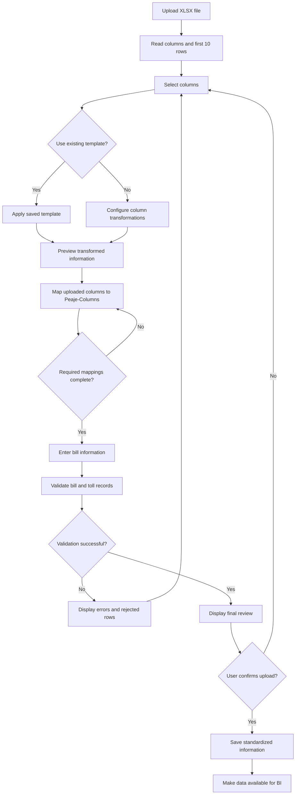
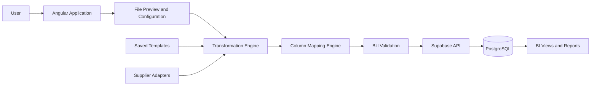
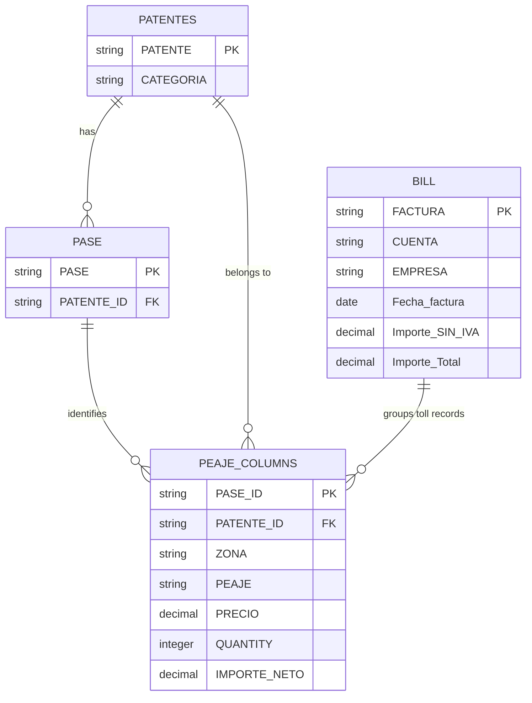
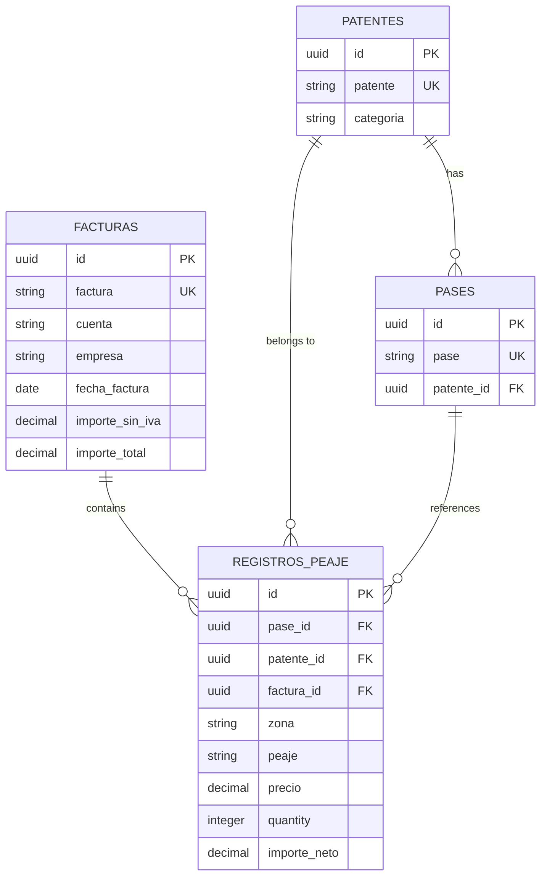

# Product Requirements Document — Module Automation Tool

## Document Control

| Field                | Details                                                                                                                                                                                           |
| -------------------- | ------------------------------------------------------------------------------------------------------------------------------------------------------------------------------------------------- |
| **Project Name**     | Module Automation Tool                                                                                                                                                                            |
| **Document Type**    | Product Requirements Document                                                                                                                                                                     |
| **Start Date**       | July 29, 2026                                                                                                                                                                                     |
| **Project Status**   | Definition / MVP Planning                                                                                                                                                                         |
| **Primary Platform** | Responsive Web Application                                                                                                                                                                        |
| **Main Objective**   | Automate the upload, standardization, validation, and storage of historical toll records and billing information to generate business intelligence for operational and financial decision-making. |

---

## 1. Product Overview

The **Module Automation Tool** is a responsive web application designed to process historical toll data provided by different suppliers.

The application will allow users to upload Excel files, inspect their columns, apply transformation algorithms, map the source information to a standardized toll-data structure, associate the records with a bill, and store the processed information.

The first version of the product will focus on providing a simple, guided workflow. The system should minimize manual data-cleaning tasks while ensuring that users can review and validate the information before completing the upload.

---

## 2. Product Goal

The main goal of the product is to create a standardized workflow that transforms supplier-specific toll files into a consistent internal data structure.

The system must:

1. Accept historical toll information in `.xlsx` format.
2. Display the uploaded columns and a preview of the data.
3. Allow users to select the columns they want to process.
4. Apply reusable transformation algorithms.
5. Map supplier columns to the internal toll structure.
6. Collect the corresponding billing information.
7. Validate the resulting data.
8. Store standardized records for future reporting and business intelligence.
9. Allow transformation configurations to be saved as reusable templates.

---

## 3. MVP Frontend Structure

The frontend should provide a simple step-by-step wizard.

### Step 1 — Upload File

The user uploads an `.xlsx` file containing historical toll information.

The interface must:

* Support drag-and-drop upload.
* Support manual file selection.
* Validate the file extension.
* Display the file name and file size.
* Notify the user when the file cannot be processed.

### Step 2 — Preview and Select Columns

The system reads the file and displays:

* The detected column names.
* The first 10 rows of the file.
* The detected data type of each column.
* A selector to include or exclude columns from processing.

The 10-row preview is intended to reduce frontend processing and improve usability when large files are uploaded.

### Step 3 — Apply Transformations

The user can apply one or more transformation algorithms to each selected column.

Examples include:

* Remove leading and trailing spaces.
* Convert text to numbers.
* Convert text to dates.
* Extract a date from a date-time value.
* Combine separate date and time columns.
* Remove special characters.
* Normalize vehicle license plates.
* Replace empty values.
* Convert decimal separators.
* Rename columns.

The applied transformations must be displayed in execution order.

### Step 4 — Map Source Columns

The user maps the uploaded columns to the standardized toll structure defined in Section 11.

Example:

| Uploaded Column    | Target Column                          |
| ------------------ | -------------------------------------- |
| `Fecha Movimiento` | `PASE_ID` or date-related source value |
| `Dominio`          | `PATENTE_ID`                           |
| `Estación`         | `PEAJE`                                |
| `Importe`          | `PRECIO`                               |
| `Cantidad`         | `QUANTITY`                             |

The system must prevent the process from continuing when a required target column has not been mapped.

### Step 5 — Enter Bill Information

For the MVP, bill information will be entered manually.

The user must complete the following fields:

* Bill number.
* Account.
* Company.
* Bill date.
* Amount excluding VAT.
* Total bill amount.

PDF bill extraction is not included in the MVP.

### Step 6 — Review and Complete Upload

The system displays a final summary containing:

* Uploaded file information.
* Selected columns.
* Applied transformations.
* Source-to-target mappings.
* Bill information.
* Validation warnings.
* First 10 transformed rows.
* Total number of valid rows.
* Total number of rejected rows.

The user must confirm the information before saving it.

---

## 4. Project Scope

### 4.1 In Scope

The MVP includes:

* Responsive web application.
* Upload of `.xlsx` files.
* Detection and display of Excel columns.
* Preview of the first 10 rows.
* Selection of columns to process.
* Application of transformation algorithms.
* Multiple transformations per column.
* Source-to-target column mapping.
* Manual bill-data entry.
* Reusable transformation templates.
* Supplier-specific processing strategies.
* Validation of required fields.
* Storage of standardized information in Supabase.
* Preparation of processed data for business-intelligence reporting.
* Final review before saving the information.

### 4.2 Out of Scope

The following items are excluded from the MVP:

* Native mobile application.
* Multi-language support.
* Automatic extraction of information from PDF bills.
* User authentication.
* Login and registration.
* Role-based permissions.
* Row Level Security.
* Multi-tenant support.
* Automatic BI dashboard generation.
* Direct integration with supplier APIs.
* Automatic email notifications.

These capabilities may be considered in future product phases.

---

## 5. Target Users

### 5.1 Operations Analyst

Uploads supplier toll files, configures transformations, maps columns, and validates the resulting data.

### 5.2 Administrative User

Enters billing information and verifies that the bill totals match the uploaded toll records.

### 5.3 Business Intelligence Analyst

Uses the standardized information to create operational, financial, and supplier-performance reports.

---

## 6. Core Features

### 6.1 Guided Workflow

The system must provide a step-by-step workflow that guides the user through the complete upload process:

1. Upload the file.
2. Preview the information.
3. Select columns.
4. Apply transformations.
5. Map columns.
6. Enter bill information.
7. Validate the results.
8. Complete the upload.

The user must be able to return to a previous step without losing the current configuration.

### 6.2 Excel File Upload

The system must accept historical toll files in `.xlsx` format.

After the upload, the application must:

* Read all available columns.
* Detect column names.
* Detect possible data types.
* Count the total number of rows.
* Display the first 10 rows.
* Notify the user about invalid or unsupported content.

### 6.3 Column Selection and Formatting

Users must be able to select which columns will be processed.

For every selected column, the user must be able to:

* Apply one or more transformation algorithms.
* Define the execution order.
* Preview the result.
* Remove a transformation.
* Reset the column configuration.

Example transformation:

```text
Original value:
" 29/07/2026 08:35 "

Transformation sequence:
1. Trim spaces
2. Convert text to DateTime
3. Extract date

Final value:
2026-07-29
```

### 6.4 Universal Multi-Adapter

Different suppliers may provide the same information using different formats.

Examples:

* `29/07/2026 08:30`
* `2026-07-29T08:30:00`
* `29-07-2026`
* Separate `Date` and `Time` columns.
* Values containing additional spaces.

The system must support multiple processing strategies that can be selected according to the supplier or file format.

The recommended technical approach is the **Strategy Design Pattern**.

Each strategy should define:

* Supported supplier or file format.
* Expected source columns.
* Required transformations.
* Column-mapping rules.
* Validation rules.
* Error-handling rules.

### 6.5 Transformation Templates

Users must be able to save a complete processing configuration as a reusable template.

A template may contain:

* Template name.
* Supplier name.
* Expected source columns.
* Selected columns.
* Transformation algorithms.
* Transformation execution order.
* Target-column mappings.
* Validation rules.
* Template version.
* Creation date.
* Last update date.

The recommended approach for constructing templates dynamically is the **Builder Design Pattern**.

### 6.6 Toll Data Adapter

The application must transform uploaded records into the standardized toll structure.

The target information includes:

* Pass identifier.
* Vehicle license plate.
* Toll zone.
* Toll station.
* Unit price.
* Quantity.
* Net amount.

### 6.7 Bill Data Capture

For the MVP, the user will enter bill information manually.

The captured information includes:

* Bill number.
* Account.
* Company.
* Bill date.
* Amount excluding VAT.
* Total bill amount.

### 6.8 Final Validation

Before completing the upload, the system must validate:

* Required columns.
* Required mappings.
* Invalid dates.
* Invalid numeric values.
* Empty license plates.
* Duplicate pass identifiers.
* Negative prices.
* Invalid quantities.
* Bill totals.
* Records that could not be transformed.

The system must distinguish between:

* **Errors:** Prevent the upload from being completed.
* **Warnings:** Allow the upload but require user review.
* **Informational messages:** Provide additional context.

---

## 7. Functional Requirements

### FR-01 — Upload Excel File

The user must be able to upload a valid `.xlsx` file.

### FR-02 — Validate File Type

The system must reject files that do not use a supported format.

### FR-03 — Display Uploaded Columns

The system must display every column detected in the uploaded file.

### FR-04 — Display Data Preview

The system must display the first 10 rows of the uploaded file.

### FR-05 — Select Columns

The user must be able to include or exclude columns from processing.

### FR-06 — Apply Column Algorithms

The user must be able to apply transformation algorithms to individual columns.

### FR-07 — Apply Multiple Algorithms

The user must be able to define an ordered sequence of transformations for the same column.

### FR-08 — Preview Transformations

The user must be able to compare the original value with the transformed value.

### FR-09 — Apply a Template

The user must be able to select and apply a previously saved transformation template.

### FR-10 — Save a Template

The user must be able to save the current configuration as a reusable template.

### FR-11 — Map Columns

The user must be able to map uploaded columns to the standardized toll columns.

### FR-12 — Validate Required Mappings

The system must prevent completion when required target fields have not been mapped.

### FR-13 — Enter Bill Information

The user must be able to manually enter the bill information associated with the uploaded file.

### FR-14 — Validate Bill Information

The system must validate required bill fields and numeric amounts.

### FR-15 — Display Final Review

The system must display all processed information before saving it.

### FR-16 — Save Processed Information

The system must save valid standardized data in PostgreSQL through Supabase.

### FR-17 — Report Rejected Rows

The system must display which rows were rejected and the reason for rejection.

### FR-18 — Prevent Duplicate Passes

The system must detect duplicate values associated with `PASE_ID`.

### FR-19 — Maintain Workflow State

The system must preserve the current configuration when the user navigates between workflow steps.

### FR-20 — Process Supplier Variations

The system must support different supplier formats through configurable processing strategies.

---

## 8. Non-Functional Requirements

### NFR-01 — Usability

The workflow must be understandable by a non-technical administrative user.

### NFR-02 — Responsive Design

The application must work correctly on desktop and tablet screen sizes.

A native mobile application is not required.

### NFR-03 — Performance

The initial preview should display no more than 10 rows.

Large files should be processed in batches or chunks to prevent browser freezes and backend timeouts.

### NFR-04 — Data Integrity

The system must not save records that fail mandatory validation rules.

### NFR-05 — Traceability

The system should record:

* Uploaded file name.
* Upload date.
* Applied template.
* Applied transformations.
* Number of processed rows.
* Number of valid rows.
* Number of rejected rows.

### NFR-06 — Maintainability

Transformation algorithms must be independent and reusable.

Adding a new supplier adapter should not require modifying existing adapters.

### NFR-07 — Scalability

The architecture should allow future support for:

* PDF processing.
* Multiple suppliers.
* Authentication.
* User roles.
* Background processing.
* Larger files.
* BI dashboards.

### NFR-08 — Error Handling

Errors must provide clear descriptions and indicate the affected row, column, and value whenever possible.

### NFR-09 — Data Consistency

Dates, prices, quantities, bill numbers, and license plates must be stored using consistent formats.

### NFR-10 — Idempotency

Uploading the same file multiple times should not create duplicate toll-pass records when the same `PASE_ID` already exists.

---

## 9. Workflow



---

## 10. Technology Stack

| Layer                        | Technology                                                    |
| ---------------------------- | ------------------------------------------------------------- |
| **Frontend / UI**            | Angular                                                       |
| **Backend Logic**            | Supabase and Supabase CLI                                     |
| **Database**                 | PostgreSQL through Supabase                                   |
| **File Processing**          | Angular for preview and backend processing for complete files |
| **Infrastructure / Hosting** | Netlify                                                       |
| **Authentication**           | Not included in the MVP                                       |
| **External Integrations**    | None in the MVP                                               |
| **Business Intelligence**    | Future integration with BI tools or reporting views           |

### 10.1 Suggested High-Level Architecture



---

## 11. Structure Goal

The following structure preserves the original business definitions and column names.

### 11.1 Peaje-Columns

The `Peaje-Columns` structure represents the standardized result of the uploaded toll information.

| Column         | Description                                       |
| -------------- | ------------------------------------------------- |
| `PASE_ID`      | Unique identifier for the toll pass.              |
| `PATENTE_ID`   | Vehicle license plate identifier.                 |
| `ZONA`         | Toll zone or location.                            |
| `PEAJE`        | Name of the toll station.                         |
| `PRECIO`       | Unit price of the toll.                           |
| `QUANTITY`     | Number of times the unit passed through the toll. |
| `IMPORTE NETO` | Total net amount.                                 |

### 11.2 Bill

The `Bill` structure represents the billing information associated with the uploaded toll records.

| Column            | Description                       |
| ----------------- | --------------------------------- |
| `FACTURA`         | Bill number.                      |
| `CUENTA`          | Account associated with the bill. |
| `EMPRESA`         | Company associated with the bill. |
| `Fecha_factura`   | Bill date.                        |
| `Importe_SIN_IVA` | Bill amount excluding VAT.        |
| `Importe_Total`   | Total bill amount.                |

### 11.3 Pase

The `Pase` structure represents an individual toll pass and its association with a vehicle license plate.

| Column       | Description                                                       |
| ------------ | ----------------------------------------------------------------- |
| `PASE`       | Unique textual identifier for the toll pass.                      |
| `PATENTE_ID` | Identifier of the vehicle license plate associated with the pass. |

### 11.4 Patentes

The `Patentes` structure contains the registered vehicle license plates and their category.

| Column      | Description                                                |
| ----------- | ---------------------------------------------------------- |
| `PATENTE`   | Unique vehicle license plate stored as a string.           |
| `CATEGORIA` | Vehicle category. Allowed values: `TRANSPORTE` or `REMIS`. |

---

## 12. Proposed Data Relationships

The following diagram represents the logical relationships between the structures.



### 12.1 Relationship Definitions

#### Patentes to Pase

* One vehicle license plate may have multiple toll passes.
* Each toll pass belongs to one vehicle license plate.
* `PASE.PATENTE_ID` logically references `PATENTES.PATENTE`.

```text
PATENTES.PATENTE
        1
        |
        N
PASE.PATENTE_ID
```

#### Pase to Peaje-Columns

* One `Pase` record identifies a toll-pass transaction.
* `PEAJE_COLUMNS.PASE_ID` is expected to reference `PASE.PASE`.

This relationship must be confirmed because the two fields currently use different names:

* `PASE_ID`
* `PASE`

#### Patentes to Peaje-Columns

* One vehicle license plate may appear in multiple toll records.
* `PEAJE_COLUMNS.PATENTE_ID` logically references `PATENTES.PATENTE`.

`PATENTE_ID` should not be unique inside `Peaje-Columns`, because the same vehicle may pass through several tolls.

#### Bill to Peaje-Columns

* One bill may contain multiple toll records.
* Each processed toll record should belong to one bill.

The current `Structure Goal` does not include a bill reference inside `Peaje-Columns`.

To implement this relationship, the physical database will require one of the following fields:

```text
FACTURA
```

or preferably:

```text
FACTURA_ID
```

This field would be added as a foreign key during the technical database-design phase without changing the current business definition.

---

## 13. Recommended Physical Database Relationships

The following structure is recommended when implementing the model in PostgreSQL.



This technical model does not replace the `Structure Goal`. It shows how the same business information can be normalized and connected safely in PostgreSQL.

---

## 14. Business Rules

### BR-01 — Unique Pass

Each value stored in `PASE_ID` must uniquely identify a toll-pass transaction.

### BR-02 — Valid Vehicle

Every `PATENTE_ID` must reference an existing vehicle license plate or create a valid new license-plate record during the upload process.

### BR-03 — Allowed Vehicle Categories

`CATEGORIA` must contain one of the following values:

```text
TRANSPORTE
REMIS
```

### BR-04 — Positive Price

`PRECIO` must be greater than or equal to zero.

### BR-05 — Valid Quantity

`QUANTITY` must be a positive integer.

### BR-06 — Net Amount Calculation

When the supplier does not provide a net amount, the application may calculate it using:

```text
IMPORTE NETO = PRECIO × QUANTITY
```

If the supplier provides an amount, the system should compare the uploaded value with the calculated result.

### BR-07 — Bill Total Validation

The sum of the toll records associated with a bill should be compared with the bill amount excluding VAT.

```text
Calculated bill amount = SUM(IMPORTE NETO)
```

A difference outside the accepted tolerance must generate a warning or error.

### BR-08 — Required Bill Association

Every completed toll-record upload must be associated with a bill.

### BR-09 — Template Compatibility

A template should only be applied automatically when the required source columns are present.

### BR-10 — Transformation Order

Transformation algorithms must be executed in the order defined by the user or template.

---

## 15. MVP Acceptance Criteria

The MVP will be considered complete when:

* A user can upload a valid `.xlsx` file.
* The system displays its columns and first 10 rows.
* The user can select the columns to process.
* The user can apply one or more transformations to a column.
* The system displays the transformed preview.
* The user can map source columns to the standardized toll structure.
* Required mappings are validated.
* The user can enter bill information manually.
* The system validates toll and bill data.
* Invalid rows are identified with a reason.
* The user can review the final result.
* Valid information can be stored in Supabase.
* A configuration can be saved as a reusable template.
* A saved template can be applied to another compatible file.
* Duplicate `PASE_ID` values are detected.
* Processed data can be queried for future BI reports.

---

## 16. Project Delivery Phases

### Phase 1 — Data Definition

* Confirm target columns.
* Confirm mandatory fields.
* Confirm primary and foreign keys.
* Define validation rules.
* Confirm the relationship between bills and toll records.

### Phase 2 — Basic Frontend Workflow

* Implement the workflow wizard.
* Implement file upload.
* Display columns.
* Display the first 10 rows.
* Allow column selection.

### Phase 3 — Transformation Engine

* Implement basic algorithms.
* Support transformation sequences.
* Implement previews.
* Create supplier strategies.

### Phase 4 — Mapping and Templates

* Implement source-to-target mapping.
* Save templates.
* Apply templates.
* Validate template compatibility.

### Phase 5 — Bill and Persistence

* Implement manual bill entry.
* Validate bill information.
* Save records in Supabase.
* Prevent duplicates.

### Phase 6 — BI Preparation

* Create database views.
* Define reporting fields.
* Validate bill totals.
* Prepare data for BI consumption.

---

## 17. Risks and Mitigation

| Risk                                                               | Impact | Mitigation                                                                                   |
| ------------------------------------------------------------------ | ------ | -------------------------------------------------------------------------------------------- |
| Supplier files use different column names and formats.             | High   | Use supplier adapters, configurable strategies, and reusable templates.                      |
| Users map the wrong source column.                                 | High   | Provide previews, data-type detection, examples, and required-field validation.              |
| Large Excel files affect performance.                              | High   | Display only 10 preview rows and process complete files in batches.                          |
| Duplicate files create duplicate records.                          | High   | Validate `PASE_ID`, file metadata, and previously imported records.                          |
| Bill totals do not match toll records.                             | Medium | Compare the bill amount with the sum of `IMPORTE NETO`.                                      |
| Templates become incompatible after supplier changes.              | Medium | Version templates and validate required columns before applying them.                        |
| The bill relationship is not represented in the current structure. | High   | Add a technical foreign key such as `FACTURA_ID` during database implementation.             |
| `PATENTE_ID` is treated as unique in toll records.                 | High   | Keep the license plate unique only in `Patentes`; allow repeated references in toll records. |
| Frontend processing consumes excessive memory.                     | Medium | Move complete-file processing to the backend and limit browser previews.                     |

---

## 18. Assumptions and Pending Definitions

The current PRD uses the following assumptions:

1. `PASE_ID` represents a unique toll-pass transaction.
2. `PEAJE_COLUMNS.PASE_ID` references `PASE.PASE`.
3. `PASE.PATENTE_ID` references `PATENTES.PATENTE`.
4. `PEAJE_COLUMNS.PATENTE_ID` references `PATENTES.PATENTE`.
5. A bill may contain multiple toll-pass records.
6. A foreign key such as `FACTURA_ID` will be required to connect toll records with a bill.
7. PDF processing will be implemented in a future phase.
8. Authentication and Row Level Security will not be implemented in the MVP.
9. Excel files will be processed through a backend service when their size makes browser processing unsafe.

The following definitions must be confirmed before creating the final database migration:

* Whether `PASE_ID` and `PASE` represent exactly the same identifier.
* Whether `FACTURA` is unique across all companies or only within the same company.
* Whether a single toll pass can contain more than one toll-detail record.
* Whether `IMPORTE NETO` includes or excludes taxes.
* The accepted difference between the bill total and the sum of toll records.
* The maximum supported Excel file size.
* Whether unknown vehicle license plates should be created automatically or rejected.
