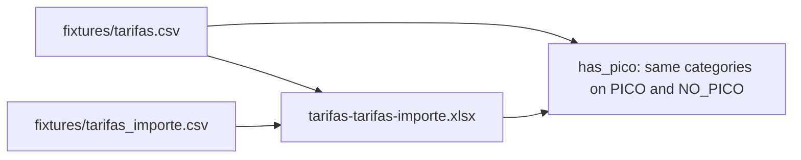

# Refactor `tarifas` + `tarifa_importe` — Execution Plan

> **For agentic workers:** REQUIRED SUB-SKILL: Use superpowers:subagent-driven-development (recommended) or superpowers:executing-plans to implement this plan task-by-task. Steps use checkbox (`- [ ]`) syntax for tracking.
>
> **This session (Wave 0):** sample files only. Do **not** run Supabase CLI, `db reset`, `db push`, MCP `apply_migration`, or any SQL that creates `tarifas` / `tarifa_importe`.

**Goal:** Freeze the future 1:N model as two CSVs of **all** PICO/NO_PICO tarifas from `pwbi_tarifas_rows.csv` (`tarifas.csv`, `tarifas_importe.csv`) plus one Excel with **only** those two sheets, so tests can inspect the split without touching the database.

**Architecture:** Split every confirmed `pwbi_tarifas` row into a catalogue key (`tarifas`) and an amount row (`tarifas_importe`). The Excel copies those two tables only. `PENDIENTE` is omitted. Schema/ETL/cutover stay in later waves.

**Tech Stack:** Node (`xlsx`, `node:test`). No PostgreSQL this wave.

**Spec:** this file; [catalogo-tarifas-audit.md](../../06-components/peajes/catalogo-tarifas-audit.md); reviewed full Excel [`auditoria-catalogo-20260904.xlsx`](../../scripts/peajes-catalogo-audit/out/auditoria-catalogo-20260904.xlsx) (do not overwrite).

**Status:** Wave 0 executable; Waves 1–4 deferred.

## Global Constraints

- No Supabase writes, no new migrations, no pgTAP, no DESARROLLO.
- Do not DROP or rewrite `tarifas_normalizadas`.
- Do not overwrite `scripts/peajes-catalogo-audit/out/auditoria-catalogo-20260904.xlsx`.
- Sample files live under `scripts/peajes-catalogo-audit/fixtures/` (CSVs) and `scripts/peajes-catalogo-audit/out/tarifas-tarifas-importe.xlsx` (Excel, 2 sheets).
- `tarifas` has no money and no required `tarifa_importe_id`. `tarifa_importe.tarifa_id` is the only FK.
- `PENDIENTE` is not a catalogue status.
- If `cluster = has_pico`, migrating PICO categories must equal migrating NO_PICO categories.
- `flat` stations are not required to have PICO.
- Column names stay Spanish in the CSV headers that map to SQL: `peaje_id`, `estacion_id`, `categoria`, `status`.
- TDD: failing `node --test` first, then implementation.
- Do not commit unless the user asks.

---

## Scope this session (Wave 0 / F14-11)

**In**

- Two CSVs with **all** PICO/NO_PICO keys and amounts from `pwbi_tarifas_rows.csv`.
- One Excel with **exactly two** sheets: `tarifas` and `tarifas_importe`.
- `has_pico` category-symmetry helper (unit tests; not extra Excel tabs).

**Out (do not execute)**

- Creating `tarifas` or `tarifa_importe` in Postgres.
- ETL into Supabase.
- Remap of `pasadas`, RPCs, `pwbi_tarifas`.
- Regenerating or replacing the reviewed 20260904 Excel.

### Sample stations (locked)

| Peaje | Station | Real IDs | Role in fixture |
|---|---|---|---|
| AUSA | ALBERTI | peaje `fcf50348-fe3d-48db-934f-13e0af1e0e74`, estación `2f14708d-f520-40d8-b5ce-cac30efdd946` | `has_pico` via `modificated=TRUE`; NO_PICO cats `2,4,7,8,9`; **fails** symmetry (no matching PICO) |
| AUTOPISTA DEL OESTE | BRANDSEN | peaje `4c3fcfe9-84f5-4b57-8875-25145b949a93`, estación `c050dabf-9137-441c-8e08-980d8665773e` | `has_pico` via `modificated=TRUE`; NO_PICO cats `2,6,7`; **fails** |
| AUBASA | MAIPU | peaje `ab449656-bebf-4cb2-bbb3-6221403e1c7b`, estación `4afa5df3-640a-49e7-96c7-8dfb9790afc5` | `flat` via `modificated=TRUE`; NO_PICO `2,3,5,6`; **passes** (rule does not apply) |
| AUBASA | HUDSON | peaje `ab449656-bebf-4cb2-bbb3-6221403e1c7b`, estación `3f32d96b-e51f-4e5e-a473-be7bcc3de5e9` | `has_pico`; PICO and NO_PICO both `2,6,7`; **passes**. At least one `tarifa_id` has two importes (1:N) |

ALBERTI example of the rule (also a unit fixture, not only the CSV): if NO_PICO is `1,2,3,4,5,7,8,9` then PICO must be the same set.

### CSV schemas (like the real tables)

`fixtures/tarifas.csv`:

```text
id,peaje_id,estacion_id,peaje_nombre,estacion_nombre,status,categoria,patron
```

`fixtures/tarifas_importe.csv`:

```text
id,tarifa_id,importe,importe_base,cases,multiplicador,desvio,hora_min,hora_max,hora_media,diagnostico,muestra_confiable,confirmado_manual,fecha_aparicion,tarifas_normalizadas_id
```

Names (`peaje_nombre`, `estacion_nombre`) are denormalized for review; they will not be SQL columns on `tarifas`.

### Excel tabs

| Sheet | Content |
|---|---|
| `tarifas` | Same rows as `tarifas.csv` (all catalogue keys) |
| `tarifas_importe` | Same rows as `tarifas_importe.csv` (all amounts, 1:N) |

No Catalogue / Missing / Summary / History / Patterns / Control sheets.

### Validation: `has_pico` category symmetry

```text
if cluster == has_pico:
  categories_NO_PICO == categories_PICO
```

Categories come from `tarifas` rows that would migrate (`status` PICO or NO_PICO). `IGNORE` is N/A on the sample CSVs. `PENDIENTE` does not count. `flat` is skipped.

---

## Target model (deferred SQL; documents the CSV columns)

```text
tarifas  1 -------- N  tarifa_importe
```

Same column contracts as the previous plan revision: unique `(peaje_id, estacion_id, status, categoria)` and `(tarifa_id, importe)`; lineage `tarifas_normalizadas_id`; names `muestra_confiable` / `confirmado_manual` / `desvio`.



---

## Waves

| Wave | This session? | Gate |
|---|---|---|
| 0 F14-11 sample CSVs + Excel + symmetry | **Yes** | `node --test scripts/peajes-catalogo-audit/*.test.mjs` |
| 1 F14-12 schema SQL | **No** | — |
| 2 F14-13 ETL CLI | **No** | — |
| 3 F14-14 cutover | **No** | — |
| 4 F14-15 full docs after SQL | **No** | Wave 0 docs only: this plan + catalogo-tarifas-audit |

---

## Tasks (Wave 0)

### F14-11a — Category symmetry helper

**Files:**
- Create: `ibarra-app/scripts/peajes-catalogo-audit/symmetry.mjs`
- Test: `ibarra-app/scripts/peajes-catalogo-audit/symmetry.test.mjs`

**Interfaces:**
- Produces: `assertPicoNoPicoSameCategories(station) → { ok, pico, no_pico, peaje, station }`
- `station`: `{ cluster, peaje_nombre, estacion_nombre, picoCats: number[], noPicoCats: number[] }`

- [x] **Step 1: Write the failing test** in `symmetry.test.mjs`: ALBERTI-style NO_PICO `{1,2,3,4,5,7,8,9}` without PICO `7` fails; identical sets on `has_pico` pass; `flat` MAIPU with only NO_PICO passes.

- [x] **Step 2: Run test to verify it fails**

Run from `ibarra-app`:

```powershell
node --test scripts/peajes-catalogo-audit/symmetry.test.mjs
```

Expected: FAIL (module or function missing).

- [x] **Step 3: Implement `assertPicoNoPicoSameCategories` in `symmetry.mjs`.** Compare sorted unique numeric sets when `cluster === 'has_pico'`.

- [x] **Step 4: Re-run the same command. Expected: PASS.**

### F14-11b — Sample CSV fixtures (like the real tables)

**Files:**
- Create: `ibarra-app/scripts/peajes-catalogo-audit/sample-model.mjs`
- Create: `ibarra-app/scripts/peajes-catalogo-audit/write-sample-files.mjs`
- Create: `ibarra-app/scripts/peajes-catalogo-audit/fixtures/tarifas.csv`
- Create: `ibarra-app/scripts/peajes-catalogo-audit/fixtures/tarifa_importe.csv`
- Test: `ibarra-app/scripts/peajes-catalogo-audit/sample-files.test.mjs`

**Interfaces:**
- Consumes: `assertPicoNoPicoSameCategories`
- Produces: `buildSampleModel() → { tarifas, tarifaImporte, summary }`
- Produces: `writeSampleCsvs(dir)` writes the two CSVs
- Produces: `loadTarifasCsv(text)`, `stationsFromTarifasAndSummary(tarifas, summary)`

- [x] **Step 1: Write failing tests** that `buildSampleModel()`:
  - has unique `tarifas` keys `(peaje_id, estacion_id, status, categoria)`
  - every `tarifa_importe.tarifa_id` exists in `tarifas`
  - HUDSON has both statuses for `2,6,7` and at least two importes on one `tarifa_id`
  - ALBERTI and BRANDSEN fail symmetry after applying `modificated` cluster
  - MAIPU does not fail
  - CSV files exist after `writeSampleCsvs` with the headers listed in this plan

- [x] **Step 2: Run** `node --test scripts/peajes-catalogo-audit/sample-files.test.mjs` — expect FAIL.

- [x] **Step 3: Implement `sample-model.mjs` + `write-sample-files.mjs` and write the two CSVs.** Use real peaje/estación UUIDs from the table above. Reuse real `tarifas_normalizadas_id` values from `pwbi_tarifas_rows.csv` when the sample amount exists in the dump (ALBERTI cat 2, MAIPU 5/6, BRANDSEN cat 2, HUDSON amounts). Synthetic cats (ALBERTI 4,7,8,9; MAIPU 2,3; BRANDSEN 6,7) get new importe ids and empty-or-new lineage ids.

- [x] **Step 4: Re-run sample-files tests. Expected: PASS.** Also run `node scripts/peajes-catalogo-audit/write-sample-files.mjs` so the CSVs are on disk.

### F14-11c — Sample Excel with tabs

**Files:**
- Modify: `ibarra-app/scripts/peajes-catalogo-audit/write-sample-files.mjs`
- Modify: `ibarra-app/scripts/peajes-catalogo-audit/generar-auditoria.mjs` (emit blank `modificated` on Catalogue Summary when generating a full audit)
- Test: extend `sample-files.test.mjs`
- Create: `ibarra-app/scripts/peajes-catalogo-audit/out/sample-tarifas-tarifa-importe.xlsx`

**Interfaces:**
- Produces: `buildSampleWorkbook(model) → XLSX workbook`
- Sheet names exactly: `tarifas`, `tarifa_importe`, `Catalogue`, `Missing Categories`, `Missing Prices`, `Missing Status`, `Catalogue Summary`, `History`, `Patterns`, `Control`

- [x] **Step 1: Write failing tests** that the workbook has those 10 sheet names; `tarifas` / `tarifa_importe` row counts match the CSVs; Summary has `modificated` TRUE for ALBERTI, BRANDSEN, MAIPU and blank/false for HUDSON.

- [x] **Step 2: Run tests — expect FAIL** until the writer exists.

- [x] **Step 3: Implement workbook writer. Do not write to the 20260904 reviewed file.** Add `modificated: ''` to `classifier.mjs` summary objects so full regenerations keep the column.

- [x] **Step 4: Run** `node --test scripts/peajes-catalogo-audit/*.test.mjs` **Expected: all PASS.** Write `out/sample-tarifas-tarifa-importe.xlsx`.

### F14-11d — Docs and feature evidence (Wave 0 only)

**Files:** Modify `INDEX.md` (this folder), `docs/06-components/peajes/catalogo-tarifas-audit.md`, `feature_list.json` F14-11, `docs/claude-progress.md`, `docs/session-handoff.md`.

- [x] Document fixture paths and that SQL is deferred.
- [x] F14-11 verification points at the two CSVs + sample xlsx + node tests. Status `passing` only for the fixture/loader wave; F14-12..F14-15 stay `not_started`.
- [x] Do not commit.

---

## Deferred tasks (do not execute until a later explicit request)

### F14-12 — Create `tarifas` and `tarifa_importe` (SQL)

Additive migration + pgTAP. Leave `tarifas_normalizadas` untouched. No DESARROLLO.

### F14-13 — ETL from Excel + `tarifas_normalizadas`

Abort if `has_pico` category sets differ. Load EXISTING / ACTION=ADD only.

**Blocker:** ALBERTI and BRANDSEN still fail on the real reviewed Excel until ACTION=ADD matching PICO rows or cluster reverted to `flat`.

### F14-14 — Cutover pasadas, RPCs, `pwbi_tarifas`

Nullable `pasadas.tarifa_importe_id`; keep old FK.

### F14-15 — Remaining product docs after SQL

---

## Verification matrix (Wave 0)

| Layer | Command | Expected |
|---|---|---|
| Unit | `node --test scripts/peajes-catalogo-audit/*.test.mjs` | PASS including symmetry + sample files |
| Files | `fixtures/tarifas.csv`, `fixtures/tarifas_importe.csv`, `out/tarifas-tarifas-importe.xlsx` | Exist; Excel has only `tarifas` and `tarifas_importe` |
| Database | — | Not run |

---

## File structure (Wave 0)

| File | Responsibility |
|---|---|
| `scripts/peajes-catalogo-audit/symmetry.mjs` | `has_pico` category set equality |
| `scripts/peajes-catalogo-audit/from-pwbi.mjs` | Split dump → `tarifas` + `tarifas_importe` |
| `scripts/peajes-catalogo-audit/write-sample-files.mjs` | Write two CSVs + 2-tab xlsx |
| `scripts/peajes-catalogo-audit/fixtures/tarifas.csv` | All catalogue keys from the dump |
| `scripts/peajes-catalogo-audit/fixtures/tarifas_importe.csv` | All PICO/NO_PICO amounts |
| `scripts/peajes-catalogo-audit/out/tarifas-tarifas-importe.xlsx` | Same two tables, two sheets |
| `scripts/peajes-catalogo-audit/out/auditoria-catalogo-20260904.xlsx` | Reviewed full Excel (do not overwrite) |

---

> Última actualización: 2026-09-04 — Wave 0 fixtures only; SQL deferred.
