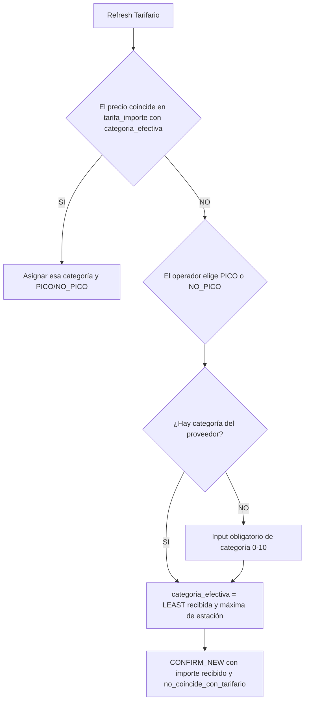

# Refresh de tarifas en Paso 9 (F14-18 + F14-19)

## Summary

Tres RPCs INVOKER contrastan precios de pasadas incluidas contra el catálogo v2 (`tarifas.current_tarifa_id` → `tarifa_importe`) con **vigencia calendario**, **corrección de categoría**, **decisiones explícitas CONFIRM_NEW / MARK_REVIEW** y historial append-only. No pisan filas históricas ni aplican `/ 1.21`. Las firmas públicas de F14-16 se conservan.

UI: diálogo xl/top en Paso 9 con **editores dinámicos por agrupación de estaciones**, tablero Actual/Detectado/Nuevo del Tarifario (sin rail de candidatos) y campo **Vigente desde** (solo inicio; el fin lo cierra el backend). Tablas: [tarifas-tarifa-importe.md](../../06-tablas/peajes/tarifas-tarifa-importe.md).

## Index

- [Summary](#summary)
- [Purpose](#purpose)
- [Business Logic](#business-logic)
- [Relations](#relations)
- [Tables](#tables)
- [Functions](#functions)
- [Policies](#policies)
- [Validations](#validations)
- [Testing](#testing)
- [Notes](#notes)

## Purpose

Impedir que una carga confirme un precio nuevo, una corrección de categoría o un status ambiguo sin decisión explícita; reconocer matches vigentes o históricos dentro de la vigencia de la pasada; y registrar filas `REVISAR` sin mover el puntero cuando el operador continúa sin resolver.

## Business Logic

### Flujo Paso 9 (F14-19)

1. El frontend extrae candidatos **distintos** de las pasadas incluidas. Precio final visible/directo: `TARIFA_PESOS` si existe, si no `PRECIO`, y `IMPORTE_NETO` solo si no hay ninguno. No se parsea `TARIFA` crudo ni se redondea el candidato. Conserva `rowIndexes`, `fecha_pasada`, `categoria_proveedor` y sentido resuelto. El flag IVA no cambia el monto mostrado: solo manda `precio_normalizado` cuando el tarifario lo pide.
2. `peajes_preparar_refresco_tarifas` resuelve identidades PICO/NO_PICO del contexto. **No** hace aritmética monetaria.
3. El adapter Angular produce `precio_normalizado` **solo** si alguna identidad preparada tiene `requiere_normalizacion_iva = true`. SQL elige según el flag. Nunca divide por 1,21.
4. `peajes_detectar_refresco_tarifas` busca primero precios actuales en todas las categorías habilitadas de la estación (tolerancia 1%), sin confiar en la categoría del proveedor. Si no hay match actual, busca importes históricos solo en `categoria_efectiva = LEAST(categoria_recibida, categoria_maxima_estación)`. Un match único reutiliza la categoría, PICO/NO_PICO y sentido del tarifario; varios matches quedan ambiguos.

| Código | Cuándo | Diálogo / Paso 9 |
|--------|--------|------------------|
| `CURRENT_TARIFF` | Importe del tarifario actual dentro de 1% en cualquier categoría compatible | No (informativo) |
| `HISTORICAL_TARIFF_MATCH` | Match único del historial en la categoría efectiva | No (informativo) |
| `CURRENT_CATEGORY_CORRECTION` | Precio actual único en una categoría distinta a la recibida | Sí (corrección explícita) |
| `HISTORICAL_CATEGORY_CORRECTION` | Match histórico de la categoría efectiva, distinta a la recibida por el cap de estación | Sí |
| `NEW_TARIFF` | Status explícito y ningún importe coincide en tarifa actual ni en historial de la categoría efectiva | Sí |
| `STATUS_REQUIRED` / `STATUS_AMBIGUOUS` | Falta status o hay más de un status candidato en esa categoría | Sí |
| `AMBIGUOUS_TARIFF_MATCH` | Más de una identidad coincide en la búsqueda aplicable | Sí |
| `DIRECTION_REQUIRED` / `DIRECTION_CONFLICT` | Sentido ausente o conflictivo | Bloquea hasta resolver sentido |
| `CONTEXT_INCOMPLETE` | Sin estación o sin categoría del proveedor y sin match tarifario único | Bloquea confirmar; el operador completa el contexto |

5. **Categoría:** `pasadas.categoria` (proveedor) no cambia. Una coincidencia única en la tarifa actual decide la categoría aunque el proveedor informe otra: Cat 5 NO_PICO $27.153,49 y proveedor Cat 7 $27.153,49 → Cat 5 NO_PICO. La categoría efectiva se usa para buscar historial cuando no hay match actual.
6. **Agrupación de estaciones (UI):** el operador indica **Grupos de tarifa** (N, min 1, max `floor(estaciones/2)`). Salen N checkboxes **Estaciones con la misma tarifa** (Grupo 1 de N, …). Cada slot con ≥2 estaciones comparte un tablero; las no asignadas o desmarcadas quedan **exactamente una vez** como editor independiente. Una estación no puede estar en dos slots: las ya usadas aparecen `disabled` en los demás. N = 1 conserva la heurística inicial (mismo precio). Los grupos viven solo en la sesión; no se persisten. Un guardado agrupado fan-out a identidades `tarifas`/`tarifa_importe` **independientes** con el mismo importe/fecha. Detectado muestra `$20.792,47 (3)`. Candidatos sin status/sentido van al **bloque final** del mismo tablero con selectores. Checkbox **Normalizar IVA** solo en identidades nuevas (hereda del tarifario, plantilla como fallback, override manual). Acciones de categoría y **Agregar categoría** fan-outean solo a las estaciones de ese editor.
7. **Guardado:** `peajes_guardar_refresco_tarifas` acepta `action`:

| Acción | Efecto |
|--------|--------|
| `CONFIRM_NEW` | Importe en **Nuevo** o leftover de revisión con Pico/No pico ya elegido. **Vigente desde** obligatorio. Cierra `fecha_vigencia_fin` del vigente; inserta `CONFIRMADO` con el precio recibido; `no_coincide_con_tarifario = true` solo en el camino sin match (revisión resuelta a mano). Promueve puntero si corresponde |
| `MARK_REVIEW` | Solo si el operador marca explícitamente revisar. Inserta `diagnostico = REVISAR` sin vigencia; **no** cierra ni promueve. |

8. **Revalidar precios** no guarda ni cierra el diálogo. Un clic reanaliza las tarifas **habilitadas** y los borradores `Nuevo` de la sesión; conserva los valores ingresados. Si catálogo y Nuevo coinciden en tolerancia 1%, **gana Nuevo**. Identidades `enabled = false` no entran al match ni al payload. Cada candidato resuelto con una identidad única sale de revisión y permanece visible, de solo lectura, en **Detectado**. Tipear otra celda no borra matches previos; vaciar Nuevo sí desasigna esa celda. Paso 9 muestra resumen en seis bloques (coincidencias, nuevas confirmadas, correcciones, vigencia, revisar, pendientes) y **no continúa** mientras quede un candidato sin `CONFIRM_NEW`, asignación a Nuevo o `MARK_REVIEW` (este último puede emitirse al guardar si la identidad ya está completa).
9. `peajes_confirmar_carga` no cambia de firma; persiste `pasadas.sentido` (default `AMBAS`).

### Revisión por status

Las filas de revisión no exponen selector de sentido ni normalización IVA. El sentido se determina internamente: familia `AMBAS` → `AMBAS`; familia direccional → `IDA`. Esto evita crear grupos `VUELTA` o `NULL` durante la revisión.

Al elegir **Pico** o **No pico**:

- No se escribe automáticamente en la última categoría del tablero.
- Si el historial tiene un match único en la **categoría efectiva** + status, se hereda y sale a **Detectado** (sin `CONFIRM_NEW`).
- Si no hay match, el candidato queda en revisión. Al guardar se envía `CONFIRM_NEW` con el importe recibido y `noCoincideConTarifario: true` (hace falta **Vigente desde**). Importes distintos en la misma celda (p. ej. $6772 y $6961) no se pisan: cada cluster se appendea como `tarifa_importe` CONFIRMADO; el último queda vigente.
- Si el proveedor no informa categoría, el input numérico 0–10 de esa fila es obligatorio; **Todas Pico / Todas No pico** omite esas filas hasta completar el input.

Ejemplo: catálogo Cat 5 NO_PICO $5000; proveedor Cat 8 $5000 → efectiva 5 → match `NO_PICO`. Cat 3 con máxima 9 busca 3, no 9.

`20260910195747_peajes_tarifario_ocultar_revision.sql` filtra `peajes_listar_tarifas_actuales` a identidades con `current_tarifa_id IS NOT NULL`, por lo que una identidad creada solamente para `REVISAR` no aparece en el Tarifario activo.

### Orden de matching (SQL)

Por candidato, primero se buscan hits de precio en la tarifa actual entre categorías, excluyendo identidades deshabilitadas y filas `REVISAR`. El historial se consulta solo en `categoria_efectiva`; también excluye identidades deshabilitadas y filas `REVISAR`.

1. Buscar el importe actual por estación en todas las categorías habilitadas. La categoría del proveedor no desempata precios actuales repetidos.
2. Si no hay match actual, calcular `categoria_efectiva = LEAST(recibida, maxima)` y buscar estación + categoría efectiva + importe en el historial. `fecha_pasada` solo clasifica CURRENT vs HISTORICAL.
3. Si hay una única identidad, reutilizar su status, sentido, tarifa e importe.
4. Si más de una identidad coincide en la búsqueda aplicable, `AMBIGUOUS_TARIFF_MATCH`.

`possible_matches` contiene matches actuales en cualquier categoría y, si no existe uno actual, hits históricos solo de la categoría efectiva. Varias identidades compatibles permanecen ambiguas.

Abrir el diálogo y **Revalidar** consultan historial por peaje + estación + importe + categoría efectiva (`peajes_buscar_historial_importes`), sin filtro de fecha. Ambas acciones resuelven una identidad histórica única dentro de esa categoría y dejan precios sin match o ambiguos para revisión.

Antes de `CONFIRM_NEW`, el diálogo omite el cambio si el importe ya es el vigente (1%) y bloquea con mensaje por estación/categoría/status si la fecha nueva es anterior o igual al vigente con otro importe.

### Vigencia e historial

- Intervalos confirmados: `[fecha_vigencia_inicio, fecha_vigencia_fin)` con fin exclusivo; `NULL` fin = abierto.
- Constraint `tarifa_importe_vigencia_confirmada_excl` (GiST): no solapamiento de periodos `CONFIRMADO` con inicio conocido.
- **Único UPDATE permitido** en historial: cerrar `fecha_vigencia_fin` una vez (`NULL` → fecha del nuevo inicio). Resto append-only.
- Legado sin fechas: `fecha_vigencia_inicio/fin` permanecen `NULL`; UI muestra vigencia desconocida. **No** se inventa backfill desde `fecha_aparicion`.

### Dominio `diagnostico`

Valores en `tarifa_importe.diagnostico`: `MUESTRA_INSUFICIENTE`, `TARIFA_UNICA`, `CATEGORIA`, `POSIBLE_HORARIO`, `REVISAR`, `CONFIRMADO`. Snapshot al insert; filas `REVISAR` no promueven puntero.

## Relations

| Consumidor | Operación |
|------------|-----------|
| `TarifaRefreshServiceImpl` | extraer → preparar → IVA adapter → detectar → guardar |
| `Paso9RevisionComponent` | Gate de confirmación + resumen + diálogo |
| `TarifaRefreshDialogComponent` | Agrupación, editores AMBAS/IDA+VUELTA, fan-out |
| `tarifa-refresh-dialog.helpers.ts` | Reductor puro de agrupación |
| `TarifarioEditorBoardComponent` | Tablero Actual/Detectado/Nuevo |
| Matcher F14-16 Paso 8 | Helpers distintos; refresh usa `_peajes_tarifas_matching_candidatos` |

## Tables

| Tabla | Rol |
|-------|-----|
| `tarifas` | Identidad + puntero + flag IVA |
| `tarifa_importe` | Historial append-only + vigencia + diagnostico |
| `pasadas` | `sentido`; categoría proveedor intacta; auditoría vía `tarifa_importe_id` |

## Functions

Migraciones:

- F14-18: `20260908150000_peajes_refresh_tarifas_paso9.sql` (preparar/detectar/guardar base)
- F14-19: `20260909181737_peajes_tarifa_vigencia_diagnostico.sql`, `20260909192938_peajes_tarifa_matching_correcciones.sql`
- Follow-up Paso 9: `20260910195747_peajes_tarifario_ocultar_revision.sql` (production MCP version `20260911111515`)
- Historial por importe: `20260911185630_peajes_buscar_historial_importes.sql`
- Categoría efectiva + flag: `20260914122527_peajes_tarifa_categoria_efectiva_no_coincide.sql`
- Precio actual entre categorías e historial limitado a categoría efectiva: `20261002164331_peajes_refresh_matching_precio_tarifario.sql`
- Filtros de dirección, estado e identidades habilitadas: `20261002170238_peajes_refresh_matching_evidence_filters.sql`

`SECURITY INVOKER`. `GRANT EXECUTE` a `authenticated, service_role`. Helpers `_peajes_tarifas_matching_candidatos`, `_peajes_aplicar_importe_guardado` no son API de producto.

| RPC | Args | Returns |
|-----|------|---------|
| `peajes_preparar_refresco_tarifas` | `p_contextos jsonb` | identidades + IVA |
| `peajes_detectar_refresco_tarifas` | `p_candidatos jsonb` | arreglo `{ id, codigo, categoria_calculada?, fecha_vigencia_*, possible_matches, ... }` |
| `peajes_guardar_refresco_tarifas` | `p_cambios jsonb` | arreglo `{ accion, tarifa_importe_id, fecha_vigencia_inicio, diagnostico, candidate_id, no_coincide_con_tarifario, ... }` |
| `peajes_buscar_historial_importes` | `p_candidatos jsonb` | arreglo `{ estacion_id, importe_consultado, count_identities, matches, tarifa_id?, categoria? }` |

**Candidato detectar:** `id`, `estacion_id`, `categoria` / `categoria_proveedor`, `status_solicitado`, `sentido_solicitado`, `fecha_pasada`, `precio_directo`, `precio_normalizado`, `unresolvedReason` opcional.

**Cambio guardar:** `action` (`CONFIRM_NEW` \| `MARK_REVIEW`), `peaje_id`, `estacion_id`, `sentido`, `categoria`, `status`, `importe`, `cases`, `fecha_vigencia_inicio` (obligatorio en CONFIRM_NEW), `categoria_calculada` opcional, `candidate_id` opcional, `requiere_normalizacion_iva` si identidad nueva, `no_coincide_con_tarifario` (true solo en no-match resuelto a mano). `SIN_CAMBIO` no se aplica cuando el flag es true.

**Transacción / locking:** validación completa del payload → `FOR UPDATE` sobre identidades `tarifas` afectadas (orden peaje/estación/sentido/categoría/status) → overlap check por vigencia → mutación vía `_peajes_aplicar_importe_guardado`.

## Policies

RLS ALL `authenticated` en `tarifas` / `tarifa_importe` (F14-16). Los RPC heredan el invocador.

## Validations

- Tolerancia: `abs(precio_comparado - importe) / importe <= 0.01`.
- Status solo `PICO` / `NO_PICO`. Sentido solo `IDA` / `VUELTA` / `AMBAS`; fail-closed sin inferir sentido desde monto.
- Celdas/candidatos duplicados en `p_cambios` → excepción.
- Estación debe pertenecer al peaje indicado.
- Superposición de vigencia confirmada → excepción (sin filas parciales).
- `MARK_REVIEW` rechaza `fecha_vigencia_inicio`.
- Historial inmutable salvo cierre único de `fecha_vigencia_fin`.

## Testing

```powershell
cd ibarra-app
npx supabase db reset --local --no-seed
npx supabase test db
pnpm seed:local
pnpm exec ng test --watch=false --browsers=ChromeHeadless `
  --include="**/tarifa-refresh.service.spec.ts" `
  --include="**/tarifa-comparison-adapter.service.spec.ts" `
  --include="**/paso9-revision/**/*.spec.ts" `
  --include="**/tarifa-refresh-dialog.helpers.spec.ts" `
  --include="**/tarifa-refresh-dialog.component.spec.ts" `
  --include="**/peajes/tarifario/**/*.spec.ts"
npx tsc --noEmit -p tsconfig.app.json
npx tsc --noEmit -p tsconfig.spec.json
npx ng build --configuration=development
```

| Suite | Archivo / ámbito |
|-------|------------------|
| pgTAP vigencia | `supabase/tests/peajes_tarifa_vigencia_test.sql` |
| pgTAP refresh | `supabase/tests/peajes_refresh_tarifas_test.sql` |
| pgTAP categoría efectiva | `supabase/tests/peajes_tarifa_categoria_efectiva_test.sql` |
| pgTAP cases | `supabase/tests/peajes_tarifa_importe_cases_test.sql` |
| Angular | helpers, dialog, Paso 9, refresh service, tarifario |

**Estado (2026-09-14):** Matching por `categoria_efectiva = LEAST(recibida, máxima de estación)` + importe 1%. Sin fallback a la última categoría. Historial acotado a peaje+estación+categoría. Leftover Pico/No pico guarda `CONFIRM_NEW` con precio y `no_coincide_con_tarifario`. Categoría nula exige input 0–10. Verify local: `npx supabase test db` **Files=21 Tests=623 PASS**; Karma diálogo+helpers+tablero+servicio+mock **164 SUCCESS**; `tsc` app+spec **EXIT 0**; `ng build --configuration=development` **EXIT 0** (NG8107 preexistente en Paso 9). `pnpm seed:local` aplicó Auth/RBAC/pasadas; `seed:tarifario-v2` EXIT 1 por cutover `null_current_pointers=27` (loader v2, no el matching). Sin `db push`.

## Notes

- Código: `tarifa-refresh.service.ts`, `tarifa-refresh-dialog.*`, `tarifa-refresh-dialog.helpers.ts` (`maxSharedGroupCount`, `resizeSharedSlots`, `applySharedSlotSelection`, `checkboxOptionsForSlot`, `sharedSlotsToTarifarioGroups`), `paso9-revision.*`, `checkbox-multi-select`. El diálogo parchea `reviewRows` y `drafts` in-place; `rebuildEditors` es sincrónico y solo reusa editores con la misma clave al agrupar.
- Tarifario de ruta: `peajes_guardar_tarifas_actuales` exige `fecha_vigencia_inicio` (F14-19); ver [tarifario.md](../../06-components/peajes/tarifario.md).
- `tarifas_normalizadas` y `peajes_normalizar_tarifas` post-carga se retienen.
- Plan: `docs/superpowers/plans/2026-09-09-tarifa-refresh-dialog-paso9-validity-corrections.md`.
Workflow:


---

> Última actualización: 2026-09-14 (categoría efectiva; flag no_coincide_con_tarifario; sin fallback a última categoría)