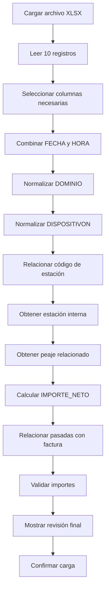

# Ejemplo del MVP — Procesamiento de pasadas por peaje

## 1. Objetivo del ejemplo

Este documento presenta un ejemplo ficticio del funcionamiento del módulo de automatización de pasadas.

El objetivo es demostrar cómo el sistema:

1. Recibe un archivo Excel.
2. Selecciona las columnas necesarias.
3. Aplica transformaciones.
4. Relaciona códigos de estaciones con estaciones internas.
5. Obtiene el peaje al que pertenece cada estación.
6. Genera una estructura estandarizada.
7. Relaciona las pasadas con una factura.
8. Valida los importes.
9. Presenta un resumen antes de confirmar la carga.

Los datos utilizados son ficticios y se emplean únicamente para validar el funcionamiento del MVP.

---

## 2. Archivo de origen

El usuario carga el archivo:

```text
pasadas_junio_2026.xlsx
```

El archivo contiene los siguientes 10 registros:

| FECHA | HORA | ESTACION | VIA | DISPOSITIVOT | DISPOSITIVON | DOMINIO | CATEGORIA | TARIFA | BONIFICACION |
|---|---:|---:|---:|---|---:|---|---:|---:|---:|
| `25/06/2026` | `205005` | `3` | `10` | `SI90` | `98702170` | `AD625QB` | `5` | `17400` | `5220` |
| `25/06/2026` | `085557` | `3` | `10` | `SI90` | `99837024` | `AB456CU` | `5` | `17400` | `5220` |
| `21/06/2026` | `202641` | `3` | `10` | `SI90` | `94911721` | `AE831SI` | `5` | `17400` | `5220` |
| `10/07/2026` | `135742` | `3` | `1` | `SI90` | `97010413` | `AE469PH` | `5` | `17400` | `5220` |
| `01/07/2026` | `131115` | `3` | `1` | `SI90` | `94931038` | `AE952TH` | `5` | `17400` | `5220` |
| `01/07/2026` | `121934` | `3` | `1` | `SI90` | `92093802` | `AD985XP` | `5` | `17400` | `5220` |
| `01/07/2026` | `120901` | `3` | `1` | `SI90` | `97010413` | `AE469PH` | `5` | `17400` | `5220` |
| `22/06/2026` | `120252` | `2` | `5` | `SI90` | `96073469` | `AB151SM` | `5` | `6600` | `1980` |
| `29/06/2026` | `104329` | `1` | `1` | `SI90` | `99793212` | `AG507DK` | `5` | `6600` | `1980` |
| `29/06/2026` | `105159` | `5` | `1` | `SI90` | `94402656` | `AC295IE` | `5` | `17400` | `9840` |

---

## 3. Selección de columnas

Para construir la estructura estandarizada, el usuario selecciona las siguientes columnas:

| Columna | Utilización |
|---|---|
| `FECHA` | Se utiliza para construir `FECHA_HORA`. |
| `HORA` | Se utiliza para construir `FECHA_HORA`. |
| `ESTACION` | Se utiliza para obtener `ESTACION_ID`. |
| `DISPOSITIVON` | Se utiliza como `PASE_ID`. |
| `DOMINIO` | Se utiliza como `PATENTE_ID`. |
| `TARIFA` | Se utiliza como `PRECIO`. |
| `BONIFICACION` | Se utiliza para calcular `IMPORTE_NETO`. |

Las siguientes columnas no se utilizan en la estructura estandarizada del MVP:

| Columna | Tratamiento |
|---|---|
| `VIA` | Se ignora en el MVP. |
| `DISPOSITIVOT` | Se ignora en el MVP. |
| `CATEGORIA` | Se ignora hasta definir una equivalencia con las categorías internas. |

Estas columnas podrán conservarse en el archivo original o en una tabla temporal de auditoría, aunque no formen parte de la estructura final.

---

## 4. Mapeo de columnas

| Columna de origen | Campo estandarizado | Transformación |
|---|---|---|
| `FECHA` + `HORA` | `FECHA_HORA` | Combinar fecha y hora. |
| `DISPOSITIVON` | `PASE_ID` | Convertir a texto y eliminar espacios. |
| `DOMINIO` | `PATENTE_ID` | Normalizar la patente. |
| `ESTACION` | `ESTACION_ID` | Buscar equivalencia en el catálogo de estaciones. |
| `TARIFA` | `PRECIO` | Convertir a número decimal. |
| `BONIFICACION` | `BONIFICACION` | Convertir a número decimal. |
| Valor generado | `QUANTITY` | Asignar el valor `1`. |
| `TARIFA - BONIFICACION` | `IMPORTE_NETO` | Calcular el importe final. |

---

## 5. Transformaciones

### 5.1 Construcción de FECHA_HORA

El sistema combina los campos `FECHA` y `HORA`.

Ejemplo:

```text
FECHA = 25/06/2026
HORA = 205005
```

El campo `HORA` utiliza el formato:

```text
HHMMSS
```

Interpretación:

```text
20 = hora
50 = minutos
05 = segundos
```

Resultado:

```text
FECHA_HORA = 2026-06-25 20:50:05
```

Cuando la hora contiene menos de seis caracteres, el sistema deberá completar el valor con ceros a la izquierda.

Ejemplo:

```text
HORA original = 85557
HORA normalizada = 085557
Resultado = 08:55:57
```

---

### 5.2 Normalización de la patente

Transformaciones:

1. Eliminar espacios al principio y al final.
2. Eliminar guiones.
3. Convertir a mayúsculas.
4. Validar que el valor no esté vacío.

Ejemplo:

```text
Valor original = " ad-625-qb "
Resultado = AD625QB
```

---

### 5.3 Normalización del pase

El campo `DISPOSITIVON` representa el número del pase o dispositivo.

Ejemplo:

```text
DISPOSITIVON = 98702170
PASE_ID = 98702170
```

`PASE_ID` puede repetirse en diferentes pasadas porque el mismo dispositivo puede utilizarse varias veces.

---

### 5.4 Cálculo de la cantidad

Cada fila del archivo representa una pasada individual.

Por lo tanto:

```text
QUANTITY = 1
```

La cantidad total de pasadas podrá calcularse posteriormente utilizando:

```sql
COUNT(PASADA_ID)
```

---

### 5.5 Cálculo del importe neto

La fórmula es:

```text
IMPORTE_NETO = PRECIO - BONIFICACION
```

Ejemplo:

```text
PRECIO = 17400
BONIFICACION = 5220

IMPORTE_NETO = 17400 - 5220
IMPORTE_NETO = 12180
```

### 5.6 Plantilla de configuración persistida

Para no repetir manualmente estas reglas en cada carga, el usuario guarda la siguiente plantilla en Supabase:

| Campo | Valor |
|---|---|
| `nombre` | `Proveedor Demo - Pasadas` |
| `descripcion` | `Normaliza fecha/hora, patente y valores monetarios.` |
| `empresa_id` | `EMP-DEMO-001` |
| `estado` | `activa` |
| `estrategia_codigo` | `PROVEEDOR_DEMO` |

La plantilla contiene configuraciones ordenadas. El `orden` es explícito y no depende del orden en que PostgreSQL devuelva las filas:

| Orden | `nombre_columna` | Tipo | Algoritmo combinado | Parámetros |
|---:|---|---|---|---|
| 10 | `FECHA_HORA` | transformación | `COMBINAR_FECHA_HORA@1` | `FECHA`, `HORA`, formato `HHMMSS` |
| 20 | `PATENTE_ID` | transformación | `NORMALIZAR_PATENTE@1` | mayúsculas, eliminar guiones y espacios |
| 30 | `PASE_ID` | transformación | `NORMALIZAR_PASE@1` | convertir a texto, quitar espacios |
| 40 | `ESTACION_ID` | mapeo | `RESOLVER_ESTACION@1` | catálogo de equivalencias del proveedor |
| 50 | `IMPORTE_NETO` | cálculo | `CALCULAR_IMPORTE_NETO@1` | `TARIFA - BONIFICACION` |

La persistencia conceptual de los algoritmos combinados es:

```json
{
  "nombre": "NORMALIZAR_PATENTE",
  "pasos": [
    {"orden": 10, "algoritmo_codigo": "BORRAR_ESPACIOS", "parametros": {"inicio_fin": true}},
    {"orden": 20, "algoritmo_codigo": "ELIMINAR_GUIONES", "parametros": {}},
    {"orden": 30, "algoritmo_codigo": "CONVERTIR_MAYUSCULAS", "parametros": {}}
  ]
}
```

### 5.7 Ejecución con Builder y Strategy

El Builder recibe la plantilla vigente y construye un pipeline de ejecución con los pasos 10, 20, 30, 40 y 50. Antes de ejecutar, valida que existan `FECHA`, `HORA`, `DOMINIO`, `DISPOSITIVON`, `ESTACION`, `TARIFA` y `BONIFICACION`.

Luego, el motor usa Strategy para resolver cada código:

```text
COMBINAR_FECHA_HORA
  → NormalizarHoraStrategy
  → ParsearFechaStrategy
  → CombinarFechaHoraStrategy

NORMALIZAR_PATENTE
  → BorrarEspaciosStrategy
  → EliminarGuionesStrategy
  → MayusculasStrategy

CALCULAR_IMPORTE_NETO
  → CalcularImporteNetoStrategy
```

El resultado de la ejecución deberá registrar, como mínimo:

* `plantilla_id = PLT-DEMO-001`.
* `algoritmo_combinado_id` y definición efectiva de cada algoritmo.
* Orden ejecutado.
* Cantidad de filas procesadas, válidas y rechazadas.
* Fila, columna y algoritmo que originó cada error.

Si el usuario modifica la plantilla o un algoritmo combinado, la definición vigente se sobrescribirá y se utilizará en las ejecuciones posteriores. El versionado histórico queda fuera del MVP.

---

## 6. Catálogo ficticio de peajes

Para este ejemplo se utiliza un único peaje ficticio.

| ID | NOMBRE | UBICACION | DESCRIPCION |
|---|---|---|---|
| `PEA-001` | `Corredores Viales Demo SA` | `Buenos Aires` | `Peaje ficticio utilizado para probar el MVP.` |

---

## 7. Catálogo ficticio de estaciones

| ID interno | Código del proveedor | NOMBRE | PEAJE_ID | UBICACION |
|---|---:|---|---|---|
| `EST-091` | `1` | `Ricchieri` | `PEA-001` | `Acceso Ricchieri` |
| `EST-092` | `2` | `Tristán Suárez` | `PEA-001` | `Autopista Ezeiza-Cañuelas` |
| `EST-096` | `3` | `Monte Grande` | `PEA-001` | `Acceso Monte Grande` |
| `EST-095` | `5` | `Mercado Central` | `PEA-001` | `Acceso Mercado Central` |

El código del proveedor no necesariamente coincide con el identificador interno de la estación.

Ejemplo:

```text
Código recibido en el archivo = 3
ESTACION_ID interno = EST-096
Estación = Monte Grande
Peaje = Corredores Viales Demo SA
```

---

## 8. Resultado estandarizado

| PASADA_ID | FECHA_HORA | PASE_ID | PATENTE_ID | ESTACION_ID | PRECIO | BONIFICACION | QUANTITY | IMPORTE_NETO |
|---|---|---|---|---|---:|---:|---:|---:|
| `PAS-0001` | `2026-06-25 20:50:05` | `98702170` | `AD625QB` | `EST-096` | `17400` | `5220` | `1` | `12180` |
| `PAS-0002` | `2026-06-25 08:55:57` | `99837024` | `AB456CU` | `EST-096` | `17400` | `5220` | `1` | `12180` |
| `PAS-0003` | `2026-06-21 20:26:41` | `94911721` | `AE831SI` | `EST-096` | `17400` | `5220` | `1` | `12180` |
| `PAS-0004` | `2026-07-10 13:57:42` | `97010413` | `AE469PH` | `EST-096` | `17400` | `5220` | `1` | `12180` |
| `PAS-0005` | `2026-07-01 13:11:15` | `94931038` | `AE952TH` | `EST-096` | `17400` | `5220` | `1` | `12180` |
| `PAS-0006` | `2026-07-01 12:19:34` | `92093802` | `AD985XP` | `EST-096` | `17400` | `5220` | `1` | `12180` |
| `PAS-0007` | `2026-07-01 12:09:01` | `97010413` | `AE469PH` | `EST-096` | `17400` | `5220` | `1` | `12180` |
| `PAS-0008` | `2026-06-22 12:02:52` | `96073469` | `AB151SM` | `EST-092` | `6600` | `1980` | `1` | `4620` |
| `PAS-0009` | `2026-06-29 10:43:29` | `99793212` | `AG507DK` | `EST-091` | `6600` | `1980` | `1` | `4620` |
| `PAS-0010` | `2026-06-29 10:51:59` | `94402656` | `AC295IE` | `EST-095` | `17400` | `9840` | `1` | `7560` |

---

## 9. Información de la factura

Para el ejemplo se utiliza la siguiente factura ficticia:

| Campo | Valor |
|---|---|
| `FACTURA` | `F-A-0001-00004567` |
| `CUENTA` | `CTA-001` |
| `EMPRESA` | `Corredores Viales Demo SA` |
| `Fecha_factura` | `2026-07-15` |
| `Importe_SIN_IVA` | `102060.00` |
| `Importe_Total` | `123492.60` |

El importe total se utiliza únicamente como dato ficticio del mockup.

---

## 10. Validación del total

La suma de los importes netos es:

```text
12180 + 12180 + 12180 + 12180 + 12180
+ 12180 + 12180 + 4620 + 4620 + 7560
= 102060
```

Comparación:

| Concepto | Importe |
|---|---:|
| Suma de `IMPORTE_NETO` | `102060.00` |
| `Importe_SIN_IVA` de la factura | `102060.00` |
| Diferencia | `0.00` |
| Estado | `Válido` |

---

## 11. Resumen del procesamiento

| Indicador | Resultado |
|---|---:|
| Registros recibidos | `10` |
| Registros procesados | `10` |
| Registros válidos | `10` |
| Registros rechazados | `0` |
| Patentes detectadas | `9` |
| Pases detectados | `9` |
| Estaciones relacionadas | `4` |
| Peajes relacionados | `1` |
| Importe neto total | `102060.00` |

La patente `AE469PH` y el pase `97010413` aparecen en dos movimientos diferentes.

Esto es válido porque `PASE_ID` identifica el dispositivo, mientras que `PASADA_ID` identifica cada transacción.

---

## 12. Flujo del ejemplo



---

## 13. Relación principal del modelo

```text
PEAJE
  └── ESTACION
        └── PASADA
              ├── PASE
              ├── PATENTE
              └── FACTURA
```

La pasada se relaciona directamente con la estación.

El peaje se obtiene mediante la relación de la estación:

```text
PASADA.ESTACION_ID → ESTACION.ID
ESTACION.PEAJE_ID → PEAJE.ID
```

---

## 14. Criterio de aceptación del ejemplo

El caso será considerado exitoso cuando:

- Se carguen los 10 registros.
- Se combinen correctamente `FECHA` y `HORA`.
- `DISPOSITIVON` se transforme en `PASE_ID`.
- `DOMINIO` se transforme en `PATENTE_ID`.
- Los cuatro códigos de estación se relacionen correctamente.
- Cada estación permita conocer su peaje.
- `QUANTITY` sea igual a `1` en cada fila.
- `IMPORTE_NETO` se calcule como `PRECIO - BONIFICACION`.
- La suma de los importes netos sea `102060.00`.
- El total coincida con el importe sin IVA de la factura.
- Los 10 registros se muestren como válidos.
- El usuario pueda confirmar la carga.
