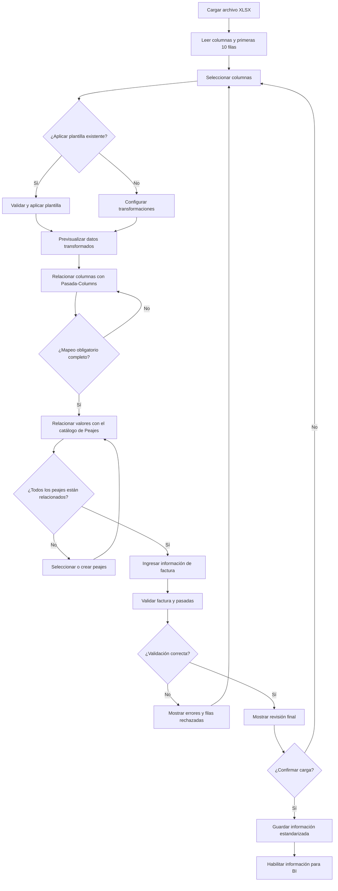
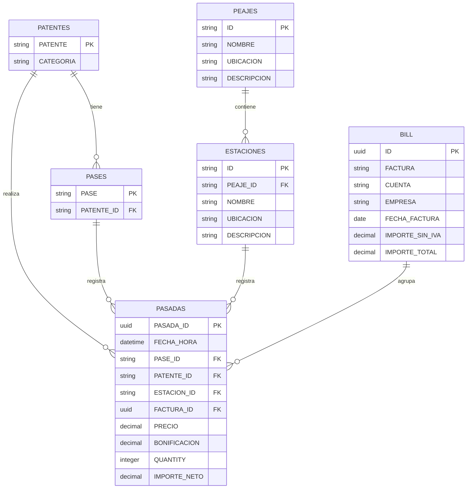
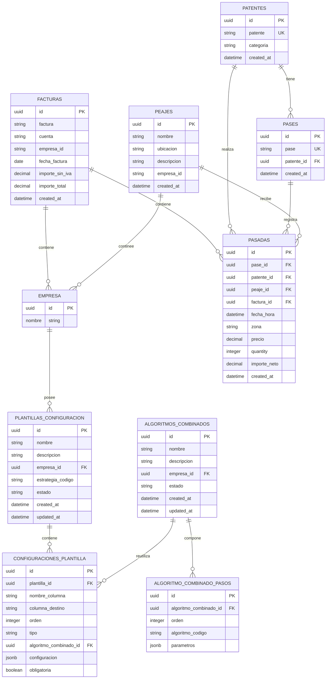
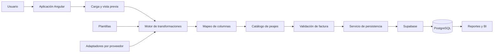

# Documento de Requisitos del Producto — Module Automation Tool

## Control del documento

| Campo                    | Detalle                                                                                                                                                                                                                                           |
| ------------------------ | ------------------------------------------------------------------------------------------------------------------------------------------------------------------------------------------------------------------------------------------------- |
| **Nombre del proyecto**  | Module Automation Tool                                                                                                                                                                                                                            |
| **Tipo de documento**    | Documento de Requisitos del Producto — PRD                                                                                                                                                                                                        |
| **Fecha de inicio**      | 29 de julio de 2026                                                                                                                                                                                                                               |
| **Estado del proyecto**  | Definición y planificación del MVP                                                                                                                                                                                                                |
| **Plataforma principal** | Aplicación web responsive                                                                                                                                                                                                                         |
| **Objetivo principal**   | Automatizar la carga, transformación, validación y almacenamiento de registros históricos de pasadas por peajes e información de facturación, con el propósito de generar datos estandarizados para inteligencia de negocio y toma de decisiones. |

---

## 1. Descripción general del producto

**Module Automation Tool** es una aplicación web responsive diseñada para procesar información histórica de pasadas por peajes proporcionada por diferentes empresas o proveedores.

La aplicación permitirá que los usuarios:

1. Carguen archivos Excel.
2. Visualicen las columnas detectadas.
3. Seleccionen las columnas que desean procesar.
4. Apliquen algoritmos de transformación.
5. Relacionen las columnas del archivo con una estructura interna estandarizada.
6. Identifiquen el peaje correspondiente a cada registro.
7. Ingresen la información de la factura.
8. Validen los resultados.
9. Almacenen la información procesada.
10. Reutilicen configuraciones mediante plantillas.

El MVP estará enfocado en ofrecer un flujo de trabajo sencillo, guiado y comprensible para usuarios  analistas.

El sistema deberá reducir las tareas manuales relacionadas con la limpieza, transformación y carga de información, sin eliminar la posibilidad de que el usuario revise y confirme los datos antes de almacenarlos.

### 1.1 Configuración mínima del proyecto existente

El módulo de Peajes se incorporará al proyecto Angular/Supabase existente de Transporte Ibarra como un **módulo funcional independiente**. En este proyecto se utiliza Angular standalone, por lo que “módulo independiente” no implica crear un `NgModule`: implica separar componentes, rutas, modelos, servicios y permisos del dominio de Peajes.

#### Contexto técnico de integración

| Elemento | Configuración mínima para Peajes |
|---|---|
| Aplicación anfitriona | `ibarra-app/` |
| Frontend | Angular 19, componentes standalone, RxJS y SCSS/CSS existente |
| Persistencia | Supabase/PostgreSQL mediante `SupabaseService` y migraciones nuevas |
| Entrada principal | Dashboard existente en `ibarra-app/src/app/components/dashboard/` |
| Identificador del dashboard | `peajes` |
| Ruta base propuesta | `/peajes` |
| Permiso base | Módulo `peajes`, acción `read` |
| Textos de interfaz | Español |
| Plantillas de Peajes | Propias del procesamiento de Excel; no reutilizan `checklist_templates` |

#### Integración mínima con el Dashboard

El dashboard deberá incorporar un nuevo elemento `DashboardModule` con esta configuración funcional:

```ts
{
  id: 'peajes',
  name: 'Peajes',
  description: 'Procesar pasadas, configuraciones y facturas de peajes',
  route: '/peajes'
}
```

El `id: 'peajes'` deberá coincidir con el nombre del módulo usado por el sistema de permisos (`system_modules.name`) para que la disponibilidad del acceso se resuelva de forma consistente. La tarjeta deberá estar visible o habilitada según el permiso `peajes:read`, siguiendo el patrón actual de `GranularPermissionService`.

La integración deberá incluir:

* Una ruta padre `/peajes` protegida por autenticación y permisos.
* Componentes hijos del dominio Peajes, ubicados bajo una carpeta propia, por ejemplo `src/app/components/peajes/`.
* Servicios propios para plantillas, algoritmos, cargas, validación y persistencia.
* Modelos propios para `PlantillaConfiguracion`, `ConfiguracionPlantilla`, `AlgoritmoCombinado` y `AlgoritmoCombinadoPaso`.
* Entrada en `app.routes.ts` y en el mapa de permisos del `PermissionGuard` cuando se creen las pantallas.

#### Separación respecto de Checklists

Las plantillas de Peajes y las plantillas de Checklists son conceptos distintos:

| Aspecto | Checklists | Peajes |
|---|---|---|
| Propósito | Definir inspecciones y respuestas operativas | Definir transformaciones y mapeos de archivos Excel |
| Tabla principal | `checklist_templates` | `plantillas_configuracion` |
| Detalle | Ítems, tipos de respuesta y validaciones de checklist | Columnas, orden, algoritmos y parámetros |
| Ejecución | Captura manual de un checklist | Pipeline de transformación de registros |
| Ruta | `/checklist`, `/templates` | `/peajes` |
| Permiso | `checklists` / `templates` | `peajes` |

No se deberán reutilizar `ChecklistTemplateService`, `checklist_templates` ni los modelos de checklist para guardar configuraciones de transformación de Peajes. Podrán reutilizarse únicamente servicios transversales ya existentes, como autenticación, permisos, manejo de sesión y acceso común a Supabase.

#### Alcance de la primera integración

La primera entrega de integración deberá limitarse a:

1. Registrar el módulo `peajes` en el dashboard.
2. Crear la ruta base `/peajes` con una pantalla inicial del módulo.
3. Definir el permiso de lectura `peajes:read` y dejar preparados los permisos de creación/gestión para las pantallas posteriores.
4. Mantener aislados los modelos y servicios de Peajes.
5. No modificar el comportamiento de Checklists, Stock, Incidentes, Flota ni Neumáticos.

La carga completa de archivos, el wizard, las plantillas y el motor de transformación forman parte del alcance funcional del módulo, pero podrán entregarse por iteraciones sin convertir Peajes en una dependencia de los módulos existentes.

---

## 2. Objetivo del producto

El objetivo principal es crear un proceso estandarizado que permita transformar archivos de peajes con diferentes formatos de origen en una estructura de datos interna consistente.

El sistema deberá:

* Aceptar información histórica en formato `.xlsx`.
* Mostrar las columnas y una vista previa de los datos.
* Detectar posibles tipos de datos.
* Permitir seleccionar las columnas que serán procesadas.
* Aplicar transformaciones individuales o grupos de transformaciones.
* Relacionar las columnas de origen con `Pasada-Columns`.
* Relacionar cada pasada con una patente.
* Relacionar cada pasada con un peaje registrado.
* Asociar la carga con una factura.
* Validar la consistencia de los datos.
* Identificar filas válidas y rechazadas.
* Guardar los registros estandarizados.
* Permitir la reutilización de configuraciones mediante plantillas.
* Preparar la información para futuros reportes de inteligencia de negocio.

---

## 3. Objetivos específicos

### 3.1 Objetivos del MVP

* Implementar una interfaz web paso a paso.
* Procesar archivos `.xlsx`.
* Mostrar una vista previa de hasta 10 registros.
* Configurar transformaciones por columna.
* Guardar secuencias de transformación.
* Relacionar columnas de origen y destino.
* Relacionar los valores de peaje con un catálogo de peajes.
* Ingresar manualmente la información de la factura.
* Validar datos antes de almacenarlos.
* Guardar la información en PostgreSQL mediante Supabase.
* Evitar registros duplicados.
* Registrar los resultados de cada carga.

### 3.2 Objetivos futuros

* Procesar facturas PDF.
* Extraer automáticamente información desde documentos.
* Incorporar autenticación.
* Incorporar permisos y roles.
* Implementar Row Level Security.
* Incorporar dashboards de inteligencia de negocio.
* Procesar archivos en segundo plano.
* Integrar APIs de proveedores.

---

## 4. Estructura del frontend del MVP

El frontend deberá implementar un asistente paso a paso.

### Paso 1 — Cargar archivo

El usuario deberá cargar un archivo `.xlsx` con información histórica de pasadas por peajes.

La interfaz deberá permitir:

* Arrastrar y soltar un archivo.
* Seleccionar manualmente un archivo.
* Validar la extensión.
* Mostrar el nombre del archivo.
* Mostrar el tamaño del archivo.
* Mostrar la cantidad de filas detectadas.
* Informar cuando el archivo sea inválido o no pueda procesarse.

### Paso 2 — Previsualizar y seleccionar columnas

Después de cargar el archivo, el sistema deberá mostrar:

* Columnas detectadas.
* Primeras 10 filas.
* Tipo de dato estimado para cada columna.
* Cantidad total de registros.
* Columnas que contienen valores vacíos.
* Columnas con posibles errores de formato.
* Selector para incluir o excluir columnas.

La vista previa estará limitada a 10 filas para evitar problemas de rendimiento en el navegador.

### Paso 3 — Aplicar transformaciones

El usuario podrá aplicar una o más transformaciones a cada columna.

Ejemplos:

* Eliminar espacios iniciales y finales.
* Convertir texto a número.
* Convertir texto a fecha.
* Convertir texto a fecha y hora.
* Extraer la fecha de un valor DateTime.
* Combinar columnas de fecha y hora.
* Reemplazar valores vacíos.
* Eliminar caracteres especiales.
* Normalizar patentes.
* Reemplazar separadores decimales.
* Convertir valores a mayúsculas.
* Renombrar columnas.
* Concatenar columnas.
* Dividir una columna.

Las transformaciones deberán ejecutarse en el orden definido por el usuario.

Ejemplo:

```text
Valor original:
" 29/07/2026 08:35 "

Transformaciones:
1. Eliminar espacios
2. Convertir texto a DateTime
3. Estandarizar formato

Resultado:
2026-07-29 08:35:00
```

### Paso 4 — Aplicar una plantilla

El usuario podrá:

* Seleccionar una plantilla existente.
* Aplicar automáticamente sus transformaciones.
* Revisar la compatibilidad de las columnas.
* Modificar la plantilla aplicada.
* Continuar sin utilizar una plantilla.

Si el sistema detecta que faltan columnas requeridas por la plantilla, deberá informar el problema antes de aplicarla.

### Paso 5 — Relacionar columnas

El usuario deberá relacionar las columnas del archivo con la estructura `Pasada-Columns`.

Ejemplo:

| Columna del archivo | Columna de destino |
| ------------------- | ------------------ |
| `ID Movimiento`     | `PASE_ID`          |
| `Fecha Movimiento`  | `FECHA_HORA`       |
| `Dominio`           | `PATENTE_ID`       |
| `Zona`              | `ZONA`             |
| `Estación`          | `PEAJE_ID`         |
| `Precio Unitario`   | `PRECIO`           |
| `Cantidad`          | `QUANTITY`         |
| `Importe`           | `IMPORTE NETO`     |

El sistema deberá impedir continuar cuando una columna obligatoria no haya sido relacionada.

### Paso 6 — Relacionar estaciones y peajes

La pasada deberá relacionarse directamente con una estación.

Cada estación pertenecerá a un peaje. Por lo tanto, el peaje asociado con una pasada se obtendrá mediante la relación de la estación.

La relación será:

```text
PASADA.ESTACION_ID → ESTACION.ID
ESTACION.PEAJE_ID → PEAJE.ID
```

El código de estación recibido en el archivo podrá ser diferente del identificador interno utilizado por el sistema.

Ejemplo:

```text
Código recibido del proveedor = 3
ESTACION_ID interno = EST-096
Estación = Monte Grande
PEAJE_ID = PEA-001
Peaje = Corredores Viales Demo SA
```

El sistema deberá permitir:

- Buscar una equivalencia exacta entre el código del proveedor y una estación interna.
- Aplicar una relación guardada previamente en una plantilla.
- Sugerir estaciones según el nombre o código recibido.
- Seleccionar manualmente una estación.
- Crear una nueva estación cuando no exista.
- Identificar estaciones sin relación.
- Mostrar el peaje al que pertenece la estación seleccionada.
- Guardar la relación entre el código del proveedor y la estación interna.

La relación entre el código del proveedor y la estación deberá formar parte de la configuración del adaptador o de la plantilla.

El sistema deberá impedir la finalización de la carga cuando existan registros sin una estación relacionada.
### Paso 7 — Ingresar información de factura

Para el MVP, la información de la factura se ingresará manualmente.

El usuario deberá completar:

* Número de factura.
* Cuenta.
* Empresa.
* Fecha de factura.
* Importe sin IVA.
* Importe total.

La extracción automática desde PDF no forma parte del MVP.

### Paso 8 — Validar información

El sistema deberá verificar:

* Campos obligatorios.
* Fechas inválidas.
* Valores numéricos inválidos.
* Patentes vacías.
* Peajes sin relacionar.
* Identificadores duplicados.
* Importes negativos.
* Cantidades inválidas.
* Registros incompletos.
* Diferencias entre el total de la factura y la suma de las pasadas.

### Paso 9 — Revisar y finalizar

Antes de guardar la información, el sistema deberá mostrar:

* Información del archivo.
* Plantilla utilizada.
* Transformaciones aplicadas.
* Relaciones entre columnas.
* Relaciones con peajes.
* Información de factura.
* Primeras 10 filas transformadas.
* Cantidad de filas válidas.
* Cantidad de filas rechazadas.
* Advertencias.
* Errores.
* Total calculado.

El usuario deberá confirmar expresamente la carga.

---

## 5. Alcance del proyecto

### 5.1 Dentro del alcance

El MVP incluye:

* Aplicación web responsive.
* Carga de archivos `.xlsx`.
* Validación del formato del archivo.
* Lectura de columnas.
* Vista previa de las primeras 10 filas.
* Selección de columnas.
* Detección básica de tipos de datos.
* Aplicación de algoritmos de transformación.
* Aplicación de múltiples algoritmos sobre una columna.
* Definición del orden de ejecución.
* Comparación entre valores originales y transformados.
* Mapeo entre columnas de origen y destino.
* Catálogo de peajes.
* Relación de registros con peajes.
* Ingreso manual de datos de factura.
* Validación de registros.
* Identificación de filas rechazadas.
* Prevención de duplicados.
* Guardado de plantillas.
* Aplicación de plantillas.
* Procesamiento mediante estrategias por proveedor.
* Almacenamiento en Supabase.
* Preparación de datos para BI.
* Registro básico de cada proceso de carga.

### 5.2 Fuera del alcance

No se incluye en el MVP:

* Aplicación móvil nativa.
* Soporte multidioma.
* Extracción automática desde PDF.
* Carga y procesamiento de facturas PDF.
* Autenticación.
* Registro e inicio de sesión.
* Roles y permisos.
* Row Level Security.
* Soporte multitenant.
* Dashboards automáticos.
* Integración directa con APIs de proveedores.
* Notificaciones por correo electrónico.
* Procesamiento automático programado.
* Aprobaciones multinivel.
* Modificación masiva posterior a la carga.

---

## 6. Usuarios objetivo

### 6.1 Analista de operaciones

Responsable de:

* Cargar archivos.
* Seleccionar columnas.
* Configurar transformaciones.
* Relacionar columnas.
* Validar patentes y peajes.
* Revisar errores.


### 6.2 Analista de inteligencia de negocio

Responsable de:

* Consultar información estandarizada.
* Construir reportes.
* Analizar gastos por vehículo.
* Analizar gastos por peaje.
* Analizar gastos por zona.
* Comparar facturas.
* Identificar patrones operativos.

---

## 7. Funcionalidades principales

### 7.1 Flujo de trabajo guiado

El sistema deberá guiar al usuario mediante los siguientes pasos:

1. Carga del archivo.
2. Vista previa.
3. Selección de columnas.
4. Configuración de transformaciones.
5. Aplicación de plantilla.
6. Relación de columnas.
7. Relación de peajes.
8. Ingreso de factura.
9. Validación.
10. Revisión final.
11. Almacenamiento.

El usuario deberá poder regresar a pasos anteriores sin perder la configuración.

### 7.2 Motor de transformaciones

El motor deberá permitir:

* Transformaciones independientes.
* Transformaciones reutilizables.
* Múltiples transformaciones por columna.
* Orden configurable.
* Vista previa inmediata.
* Validación del resultado.
* Registro de las transformaciones aplicadas.

### 7.3 Multi-Adapter universal

Los proveedores pueden utilizar diferentes nombres, formatos y estructuras.

Ejemplos de una misma fecha:

* `29/07/2026 08:30`
* `2026-07-29T08:30:00`
* `29-07-2026`
* Fecha y hora en columnas separadas.
* Valores con espacios adicionales.

El sistema deberá soportar estrategias específicas por proveedor.

Se recomienda aplicar el patrón de diseño **Strategy**.

Cada estrategia podrá definir:

* Proveedor.
* Columnas esperadas.
* Formatos conocidos.
* Transformaciones requeridas.
* Reglas de mapeo.
* Reglas de validación.
* Reglas de normalización.
* Manejo de errores.

### 7.4 Plantillas de transformación

El usuario podrá guardar una configuración como plantilla.

Cada plantilla podrá contener:

* Nombre.
* Proveedor.
* Descripción.
* Columnas esperadas.
* Columnas seleccionadas.
* Transformaciones.
* Orden de ejecución.
* Relaciones de columnas.
* Relaciones con peajes.
* Reglas de validación.
* Fecha de creación.
* Fecha de modificación.

Para la construcción dinámica de plantillas se recomienda utilizar el patrón **Builder**.

#### 7.4.1 Modelo de configuración persistente

La plantilla se guardará como una definición editable y sus pasos ordenados. En el MVP, una edición actualizará la configuración existente y podrá sobrescribir la definición anterior.

Cada plantilla deberá guardar como mínimo:

* `nombre`, `descripcion` y `empresa_id`.
* `estado` (`borrador`, `activa`, `archivada`).
* Proveedor o estrategia de origen, cuando corresponda.
* Fecha de creación y actualización.
* Usuario que la creó o publicó, cuando exista autenticación.

Cada configuración de una plantilla deberá vincular `nombre_columna`, campo estandarizado de destino, `orden` de ejecución, tipo de configuración, parámetros declarativos en `jsonb`, obligatoriedad y comportamiento ante error. Podrá referenciar un `algoritmo_combinado_id` cuando el paso utilice una secuencia reutilizable.

El orden persistido es parte del contrato funcional: el motor deberá ejecutar los pasos ascendentemente por `orden`. Nunca se deberá inferir el orden por el nombre, la fecha de creación o el orden accidental de una consulta.

#### 7.4.2 Algoritmos combinados

Un **algoritmo combinado** es una definición reutilizable de pasos elementales. Por ejemplo, `NORMALIZAR_PATENTE` puede estar compuesto por `BORRAR_ESPACIOS`, `ELIMINAR_GUIONES` y `CONVERTIR_MAYUSCULAS`.

Cada algoritmo combinado deberá guardar nombre, descripción, empresa propietaria o indicador de algoritmo global, estado y una lista ordenada de pasos elementales con sus parámetros. Los pasos se identificarán mediante códigos estables como `BORRAR_ESPACIOS`, `COMBINAR_COLUMNAS`, `FORMATEAR_FECHA_HORA` o `CALCULAR_IMPORTE_NETO`; el código no dependerá del texto visible en la interfaz.

#### 7.4.3 Builder + Strategy

Se utilizará una combinación de patrones:

* **Builder:** construirá una plantilla o pipeline válido de forma incremental. Validará campos obligatorios, asignará el orden, agregará configuraciones, mapeos y algoritmos combinados, y producirá una definición lista para persistir o ejecutar.
* **Strategy:** el motor seleccionará en tiempo de ejecución una estrategia de proveedor o de algoritmo elemental. Cada estrategia encapsulará una forma concreta de transformar, normalizar, validar o resolver una columna bajo un contrato común.

El Builder define **qué pipeline** se ejecutará; Strategy define **cómo se ejecuta cada operación**. La base de datos guarda la definición declarativa y el código de la aplicación mantiene el registro seguro de estrategias permitidas. No se ejecutará código ni SQL recibido desde `jsonb`.

Flujo esperado:

```text
Plantilla + Configuraciones ordenadas
        → Builder
        → Pipeline de ejecución
        → StrategyRegistry
        → Transformación por fila/columna
        → Resultado + trazabilidad + errores
```

Una plantilla aplicada a una carga deberá conservar el `plantilla_id`, los algoritmos combinados utilizados y los parámetros efectivos de la ejecución. El versionado histórico de plantillas y algoritmos queda fuera del MVP y se planifica para una fase futura.

### 7.5 Catálogo de peajes

El sistema deberá contar con un catálogo de peajes.

Cada peaje tendrá:

* Identificador único.
* Nombre.
* Ubicación.
* Descripción.

Este catálogo permitirá evitar que el nombre del peaje se repita como texto en todos los registros.

### 7.6 Validación final

El sistema deberá diferenciar:

* **Error:** impide finalizar la carga.
* **Advertencia:** permite continuar después de una revisión.
* **Información:** comunica un resultado sin bloquear el proceso.

---

## 8. Requisitos funcionales

### RF-01 — Cargar archivos Excel

El usuario deberá poder cargar un archivo `.xlsx`.

### RF-02 — Validar el tipo de archivo

El sistema deberá rechazar formatos no soportados.

### RF-03 — Mostrar columnas

El sistema deberá mostrar todas las columnas detectadas.

### RF-04 — Mostrar una vista previa

El sistema deberá mostrar las primeras 10 filas.

### RF-05 — Seleccionar columnas

El usuario deberá poder incluir o excluir columnas.

### RF-06 — Detectar tipos de datos

El sistema deberá sugerir el tipo de dato de cada columna.

### RF-07 — Aplicar transformaciones

El usuario deberá poder aplicar transformaciones por columna.

### RF-08 — Aplicar transformaciones múltiples

El usuario deberá poder configurar una secuencia de algoritmos.

### RF-09 — Ordenar transformaciones

El usuario deberá poder modificar el orden de ejecución.

### RF-10 — Previsualizar resultados

El usuario deberá comparar el valor original y el transformado.

### RF-11 — Guardar plantillas

El usuario deberá guardar una configuración completa.

### RF-12 — Aplicar plantillas

El usuario deberá aplicar plantillas sobre archivos compatibles.

### RF-13 — Validar compatibilidad

El sistema deberá comprobar las columnas requeridas por una plantilla.

### RF-14 — Relacionar columnas

El usuario deberá mapear columnas de origen con `Pasada-Columns`.

### RF-15 — Validar relaciones obligatorias

El sistema deberá impedir continuar cuando falten relaciones requeridas.

### RF-16 — Relacionar peajes

El sistema deberá relacionar el valor del archivo con `Peaje.ID`.

### RF-17 — Sugerir coincidencias de peajes

El sistema deberá sugerir peajes existentes a partir del nombre cargado.

### RF-18 — Resolver peajes desconocidos

El usuario deberá poder seleccionar o crear un peaje cuando no exista una coincidencia.

### RF-19 — Ingresar información de factura

El usuario deberá ingresar manualmente la factura.

### RF-20 — Validar factura

El sistema deberá validar los campos e importes de la factura.

### RF-21 — Mostrar revisión final

El sistema deberá mostrar la información antes del almacenamiento.

### RF-22 — Guardar información

El sistema deberá guardar los datos válidos mediante Supabase.

### RF-23 — Informar filas rechazadas

El sistema deberá mostrar la fila, columna, valor y motivo del rechazo.

### RF-24 — Evitar duplicados

El sistema deberá detectar registros previamente cargados.

### RF-25 — Mantener el estado del flujo

El sistema deberá conservar la configuración entre pasos.

### RF-26 — Registrar la carga

El sistema deberá registrar el archivo, fecha, resultados y plantilla utilizada.

### RF-27 — Crear plantilla de configuración

El usuario autorizado deberá poder crear una plantilla con nombre, descripción, empresa, estrategia de proveedor y configuraciones ordenadas.

### RF-28 — Editar y sobrescribir plantillas

El usuario deberá poder modificar una plantilla existente. En el MVP, la nueva configuración reemplazará la configuración anterior de la plantilla mediante una operación transaccional.

### RF-29 — Crear algoritmos combinados

El sistema deberá permitir definir un algoritmo combinado como una lista ordenada de algoritmos elementales y parámetros. Deberá impedir referencias a códigos de algoritmos no registrados.

### RF-30 — Aplicar algoritmos combinados

Una configuración de columna podrá referenciar un algoritmo combinado. El sistema deberá expandirlo en el orden guardado y mostrar los pasos efectivos antes de confirmar la carga.

### RF-31 — Validar definiciones antes de publicar

El sistema deberá validar que no existan órdenes duplicados, columnas obligatorias ausentes, referencias rotas o parámetros incompatibles con la estrategia seleccionada.

### RF-32 — Auditar la ejecución

El sistema deberá guardar para cada carga la plantilla, algoritmos combinados, parámetros efectivos, cantidad de filas procesadas y errores por paso.

### RF-33 — Integrar Peajes con el proyecto existente

El sistema deberá incorporar el módulo funcional `peajes` al dashboard existente, con ruta base `/peajes`, permiso `peajes:read` y componentes, servicios y modelos propios del dominio.

### RF-34 — Mantener separación de plantillas

El sistema deberá guardar las configuraciones de transformación de Peajes en sus propias tablas y servicios. No deberá utilizar las plantillas ni los servicios de Checklists para representar configuraciones de archivos Excel.

---

## 9. Requisitos no funcionales

### RNF-01 — Usabilidad

El flujo deberá ser comprensible para usuarios sin conocimientos técnicos.

### RNF-02 — Diseño responsive

La aplicación deberá funcionar en computadoras y tablets.

### RNF-03 — Rendimiento

La vista previa estará limitada a 10 filas.

Los archivos completos deberán procesarse en backend cuando su tamaño pueda afectar al navegador.

### RNF-04 — Integridad de los datos

No deberán almacenarse registros que incumplan validaciones obligatorias.

### RNF-05 — Trazabilidad

El sistema deberá registrar:

* Archivo cargado.
* Fecha de carga.
* Plantilla utilizada.
* Transformaciones.
* Cantidad de registros.
* Filas válidas.
* Filas rechazadas.
* Resultado final.

### RNF-06 — Mantenibilidad

Los adaptadores y algoritmos deberán ser independientes.

Agregar un proveedor no deberá requerir modificar los proveedores existentes.

### RNF-07 — Escalabilidad

La solución deberá permitir incorporar en el futuro:

* PDF.
* Autenticación.
* Roles.
* Procesamiento asíncrono.
* Archivos de mayor tamaño.
* Dashboards.
* Integraciones externas.

### RNF-08 — Manejo de errores

Cada error deberá indicar, cuando corresponda:

* Fila.
* Columna.
* Valor.
* Regla incumplida.
* Acción recomendada.

### RNF-09 — Consistencia

Las fechas, patentes, importes, cantidades y nombres deberán guardarse en formatos estandarizados.

### RNF-10 — Idempotencia

Procesar el mismo archivo más de una vez no deberá producir registros duplicados.

---

## 10. Flujo de trabajo del sistema



---

## 11. Structure Goal

La siguiente estructura representa el modelo de negocio estandarizado del MVP.

### 11.1 Pasada-Columns

La estructura `Pasada-Columns` representa cada movimiento individual realizado por un vehículo en una estación.

| Columna | Descripción |
|---|---|
| `PASADA_ID` | Identificador único de la transacción, generado por el sistema. |
| `FECHA_HORA` | Fecha y hora en la que ocurrió la pasada. |
| `PASE_ID` | Identificador del pase o dispositivo utilizado. |
| `PATENTE_ID` | Identificador de la patente del vehículo. |
| `ESTACION_ID` | Identificador de la estación en la que ocurrió la pasada. |
| `PRECIO` | Tarifa original correspondiente a la pasada. |
| `BONIFICACION` | Descuento aplicado sobre el precio original. |
| `QUANTITY` | Cantidad de pasadas representadas por el registro. Para un movimiento individual será `1`. |
| `IMPORTE NETO` | Importe final después de aplicar la bonificación. |

La regla de cálculo será:

```text
IMPORTE NETO = PRECIO - BONIFICACION
```

`PASADA_ID` identifica una transacción individual.

`PASE_ID` identifica el dispositivo o pase utilizado y puede repetirse en múltiples transacciones.

El campo `ZONA` no será incluido inicialmente en el MVP porque todavía no posee una definición de negocio precisa.

Podrá incorporarse posteriormente cuando se determine si representa:

- Una región geográfica.
- Un corredor vial.
- Una concesión.
- Una agrupación interna.
- Una categoría operativa.

### 11.2 Bill

La estructura `Bill` representa la factura asociada con un conjunto de pasadas.

| Columna | Descripción |
|---|---|
| `FACTURA` | Número de factura. |
| `CUENTA` | Cuenta asociada con la factura. |
| `EMPRESA` | Empresa que emitió la factura. |
| `Fecha_factura` | Fecha de emisión de la factura. |
| `Importe_SIN_IVA` | Importe de la factura sin IVA. |
| `Importe_Total` | Importe total de la factura. |

### 11.3 Pase

La estructura `Pase` representa el dispositivo utilizado para registrar las pasadas del vehículo.

| Columna | Descripción |
|---|---|
| `PASE` | Número único del pase o dispositivo. |
| `PATENTE_ID` | Identificador de la patente asociada con el pase. |

Un pase podrá aparecer en múltiples registros de `Pasada-Columns`.

### 11.4 Patentes

La estructura `Patentes` contiene las patentes registradas y su categoría interna.

| Columna | Descripción |
|---|---|
| `PATENTE` | Patente única del vehículo almacenada como texto. |
| `CATEGORIA` | Categoría interna del vehículo. Valores permitidos: `TRANSPORTE` o `REMIS`. |

La categoría proporcionada por el archivo del proveedor no deberá utilizarse automáticamente como categoría interna sin una regla de equivalencia previamente definida.

### 11.5 Peaje

La estructura `Peaje` representa la entidad principal que contiene una o más estaciones.

| Columna | Descripción |
|---|---|
| `ID` | Identificador único del peaje. |
| `NOMBRE` | Nombre del peaje, corredor o empresa relacionada. |
| `UBICACION` | Ubicación general del peaje. |
| `DESCRIPCION` | Información adicional sobre el peaje. |

Un peaje podrá contener múltiples estaciones.

### 11.6 Estación

La estructura `Estacion` representa el punto específico en el que ocurre una pasada.

| Columna | Descripción |
|---|---|
| `ID` | Identificador único de la estación. |
| `PEAJE_ID` | Identificador del peaje al que pertenece la estación. |
| `NOMBRE` | Nombre de la estación. |
| `UBICACION` | Ubicación específica de la estación. |
| `DESCRIPCION` | Información adicional sobre la estación. |

Cada estación deberá pertenecer a un peaje.

Una estación podrá registrar múltiples pasadas.
## 12. Relaciones lógicas de datos



### 12.1 Peaje y estación

Un peaje podrá contener múltiples estaciones.

Cada estación deberá pertenecer a un único peaje.

```text
ESTACION.PEAJE_ID → PEAJE.ID
```

Cardinalidad:

```text
PEAJE 1 ─── N ESTACION
```

### 12.2 Estación y pasada

Una estación podrá registrar múltiples pasadas.

Cada pasada deberá estar relacionada con una estación.

```text
PASADA.ESTACION_ID → ESTACION.ID
```

Cardinalidad:

```text
ESTACION 1 ─── N PASADA
```

La pasada no necesita guardar directamente `PEAJE_ID`, porque el peaje puede obtenerse mediante la estación.

### 12.3 Pase y pasada

Un pase podrá aparecer en múltiples pasadas.

```text
PASADA.PASE_ID → PASE.PASE
```

Cardinalidad:

```text
PASE 1 ─── N PASADA
```

`PASE_ID` no deberá utilizarse como identificador único de la transacción.

### 12.4 Patente y pasada

Una patente podrá realizar múltiples pasadas.

```text
PASADA.PATENTE_ID → PATENTES.PATENTE
```

Cardinalidad:

```text
PATENTES 1 ─── N PASADA
```

### 12.5 Factura y pasada

Una factura podrá agrupar múltiples pasadas.

```text
PASADA.FACTURA_ID → BILL.ID
```

Cardinalidad:

```text
BILL 1 ─── N PASADA
```

`FACTURA_ID` será una clave técnica incorporada en el modelo físico para relacionar cada pasada con su factura.
## 13. Definición de las relaciones

### 13.1 Relación entre Patentes y Pase

Una patente puede tener uno o varios pases asociados.

Cada pase pertenece a una patente.

```text
PASE.PATENTE_ID → PATENTES.PATENTE
```

La cardinalidad esperada es:

```text
PATENTES 1 ─── N PASE
```

### 13.2 Relación entre Patentes y Pasada-Columns

Una patente puede aparecer en múltiples pasadas.

Cada pasada corresponde a una patente.

```text
PASADA_COLUMNS.PATENTE_ID → PATENTES.PATENTE
```

La cardinalidad esperada es:

```text
PATENTES 1 ─── N PASADA_COLUMNS
```

`PATENTE_ID` no debe ser único dentro de `Pasada-Columns`, ya que una misma patente puede pasar múltiples veces por uno o varios peajes.

### 13.3 Relación entre Pase y Pasada-Columns

Un pase puede registrar múltiples movimientos o pasadas.

Para implementar esta relación, se interpreta que:

```text
PASADA_COLUMNS.PASE_ID → PASE.PASE
```

Sin embargo, deberá confirmarse si `PASE_ID` representa:

* El identificador del dispositivo o pase asociado al vehículo.
* El identificador único de cada movimiento.

Si un mismo pase puede utilizarse varias veces, `PASE_ID` no debe ser una clave única en `Pasada-Columns`.

En ese caso, la tabla física deberá tener una clave técnica independiente, por ejemplo:

```text
ID UUID
```

### 13.4 Relación entre Peaje y Pasada-Columns

Un peaje puede registrar múltiples pasadas.

Cada pasada deberá estar relacionada con un peaje.

```text
PASADA_COLUMNS.PEAJE_ID → PEAJE.ID
```

La cardinalidad es:

```text
PEAJE 1 ─── N PASADA_COLUMNS
```

Esta relación permite almacenar solamente el identificador del peaje dentro de cada pasada y mantener el nombre, ubicación y descripción en un catálogo independiente.

### 13.5 Relación entre Bill y Pasada-Columns

Una factura puede contener múltiples pasadas.

Cada pasada procesada deberá pertenecer a una factura.

La estructura actual de `Pasada-Columns` no incluye una referencia a `Bill`.

Para implementar esta relación en PostgreSQL será necesario agregar una clave foránea técnica, preferentemente:

```text
FACTURA_ID
```

La relación sería:

```text
PASADA_COLUMNS.FACTURA_ID → BILL.ID
```

La incorporación de esta clave técnica no modifica la definición de negocio presentada en `Structure Goal`.

---

## 14. Modelo físico recomendado para PostgreSQL

El siguiente modelo representa una posible implementación técnica normalizada.



### 14.1 Equivalencias entre el modelo de negocio y el modelo físico

| Structure Goal   | Modelo físico recomendado |
| ---------------- | ------------------------- |
| `Pasada-Columns` | `pasadas`                 |
| `Bill`           | `facturas`                |
| `Pase`           | `pases`                   |
| `Patentes`       | `patentes`                |
| `Peaje`          | `peajes`                  |
| `IMPORTE NETO`   | `importe_neto`            |
| `Fecha_factura`  | `fecha_factura`           |
| `PEAJE_ID`       | `peaje_id`                |
| `PATENTE_ID`     | `patente_id`              |
| `PASE_ID`        | `pase_id`                 |

El modelo físico utiliza nombres sin espacios y en formato `snake_case` para facilitar la implementación en PostgreSQL.

### 14.2 Tablas de plantillas y algoritmos

La implementación de Supabase deberá crear las tablas anteriores mediante una migración nueva, sin editar migraciones ya aplicadas.

Reglas mínimas de integridad:

* `configuraciones_plantilla` tendrá una restricción única sobre (`plantilla_id`, `nombre_columna`, `orden`).
* `algoritmo_combinado_pasos` tendrá una restricción única sobre (`algoritmo_combinado_id`, `orden`).
* `algoritmos_combinados` tendrá una restricción única sobre (`nombre`, `empresa_id`).
* Los `jsonb` solo contendrán parámetros declarativos validados por el registro de estrategias.
* La actualización de una plantilla deberá reemplazar sus configuraciones dentro de una transacción para evitar estados parciales.
* El versionado histórico de plantillas y algoritmos combinados queda fuera del MVP y se implementará mediante una evolución posterior del modelo.

Ejemplo conceptual de persistencia:

```json
{
  "plantilla": {
    "nombre": "Proveedor Demo - Pasadas",
    "descripcion": "Normaliza archivos con FECHA y HORA separadas",
    "empresa_id": "empresa-demo"
  },
  "configuraciones": [
    {
      "nombre_columna": "FECHA_HORA",
      "orden": 10,
      "tipo": "transformacion",
      "algoritmo_combinado": "COMBINAR_FECHA_HORA",
      "configuracion": {"columnas": ["FECHA", "HORA"], "formato_hora": "HHMMSS"}
    },
    {
      "nombre_columna": "DOMINIO",
      "orden": 20,
      "tipo": "transformacion",
      "algoritmo_combinado": "NORMALIZAR_PATENTE",
      "configuracion": {"mayusculas": true}
    }
  ]
}
```

---

## 15. Reglas de negocio

### RN-01 — Identificador de la pasada

Cada movimiento deberá tener un `PASADA_ID` único generado por el sistema.

### RN-02 — Pase reutilizable

`PASE_ID` identifica el pase o dispositivo utilizado.

El mismo `PASE_ID` podrá aparecer en múltiples pasadas.

### RN-03 — Patente válida

Cada `PATENTE_ID` deberá referenciar una patente existente o una nueva patente validada durante la carga.

### RN-04 — Estación obligatoria

Cada pasada deberá estar relacionada con una estación existente.

```text
PASADA.ESTACION_ID → ESTACION.ID
```

No se deberá guardar una pasada sin una estación relacionada.

### RN-05 — Peaje obtenido mediante la estación

El peaje correspondiente a una pasada deberá obtenerse a partir de la estación.

```text
PASADA.ESTACION_ID → ESTACION.ID
ESTACION.PEAJE_ID → PEAJE.ID
```

### RN-06 — Fecha y hora válidas

`FECHA_HORA` deberá contener una fecha y hora válidas.

Cuando la hora tenga menos de seis caracteres, deberá completarse con ceros a la izquierda.

Ejemplo:

```text
85557 → 085557 → 08:55:57
```

### RN-07 — Cantidad por defecto

Cada fila del archivo representa una pasada individual.

Por lo tanto:

```text
QUANTITY = 1
```

### RN-08 — Precio válido

`PRECIO` deberá ser mayor o igual a cero.

### RN-09 — Bonificación válida

`BONIFICACION` deberá ser mayor o igual a cero.

La bonificación no deberá ser superior al precio, excepto cuando exista una regla de negocio específica que lo permita.

### RN-10 — Cálculo del importe neto

El importe neto se calculará utilizando:

```text
IMPORTE NETO = PRECIO - BONIFICACION
```

### RN-11 — Validación del importe calculado

Cuando el archivo incluya un importe final, el sistema deberá compararlo con el resultado calculado.

Una diferencia deberá generar una advertencia.

### RN-12 — Asociación con factura

Toda carga confirmada deberá estar relacionada con una factura.

### RN-13 — Validación de factura

La suma de `IMPORTE NETO` deberá compararse con `Importe_SIN_IVA`.

```text
Total calculado = SUM(IMPORTE NETO)
```

### RN-14 — Columnas no utilizadas

Las columnas no seleccionadas no formarán parte de la estructura estandarizada.

Podrán conservarse en:

- El archivo original.
- Una tabla temporal.
- Un campo de auditoría.
- Un registro de datos sin procesar.

### RN-15 — Categoría del proveedor

La categoría recibida desde el proveedor no se utilizará automáticamente como categoría interna.

Será necesaria una regla de equivalencia para convertirla en:

```text
TRANSPORTE
```

o:

```text
REMIS
```

### RN-16 — Prevención de duplicados

El sistema deberá detectar posibles pasadas duplicadas.

Una posible clave de negocio será:

```text
PASE_ID + FECHA_HORA + ESTACION_ID + PATENTE_ID
```
Esta combinación deberá validarse durante el diseño técnico.

### RN-17 — Validaciones factura con pasadas
El importe neto toal de las facturas tiene que ser igual al importe neto de la factura, para que se pueda guardar

### RN-18 — Orden determinista de configuración

Los pasos se ejecutarán por `orden` ascendente. No se permitirá publicar una plantilla con órdenes duplicados dentro de la misma columna o pipeline.

### RN-19 — Sobrescritura controlada de configuraciones

En el MVP, una plantilla o algoritmo combinado podrá editarse y sobrescribir su definición actual. La actualización deberá validar la configuración completa antes de reemplazarla.

### RN-20 — Referencias seguras a algoritmos

La base de datos guardará identificadores/códigos y parámetros, pero nunca código ejecutable. El motor solo resolverá estrategias registradas en un catálogo interno permitido.

### RN-21 — Compatibilidad antes de ejecutar

Antes de aplicar una plantilla, el sistema deberá verificar columnas requeridas, tipos esperados, parámetros y disponibilidad de las estrategias. Una incompatibilidad bloqueará la ejecución y mostrará el motivo.

### RN-22 — Reutilización controlada

Un algoritmo combinado podrá reutilizarse en varias plantillas. Si se modifica, el cambio aplicará a las plantillas que lo referencien en las ejecuciones posteriores.

### RN-23 — Alcance por empresa

Una plantilla o algoritmo combinado de una empresa no podrá aplicarse a otra empresa salvo que se marque explícitamente como recurso global del sistema.

### RN-24 — Trazabilidad por paso

Ante un error o rechazo, el sistema deberá informar fila, columna, orden, algoritmo, mensaje y valor recibido, sin exponer secretos ni código interno.

### RN-25 — Actualización transaccional

La plantilla, sus configuraciones y los pasos de sus algoritmos combinados deberán actualizarse en una operación transaccional. No podrá quedar una definición parcialmente sobrescrita.

## 16. Criterios de aceptación del MVP

El MVP será considerado terminado cuando:

* El usuario pueda cargar un archivo `.xlsx`.
* El sistema pueda detectar sus columnas.
* El sistema muestre las primeras 10 filas.
* El usuario pueda seleccionar columnas.
* El usuario pueda aplicar una o más transformaciones.
* El sistema muestre el resultado transformado.
* El usuario pueda guardar una plantilla.
* El usuario pueda aplicar una plantilla.
* El dashboard muestre el módulo independiente `peajes` con ruta `/peajes`.
* El acceso al módulo se resuelva mediante el permiso `peajes:read`.
* Las plantillas de Peajes se almacenen separadas de `checklist_templates`.
* La plantilla guardada incluya nombre, descripción, empresa y estado.
* Cada configuración persista `nombre_columna`, parámetros y `orden` determinista.
* El usuario pueda crear, editar y reutilizar algoritmos combinados.
* El sistema rechace referencias a estrategias o algoritmos inexistentes.
* El usuario pueda editar una plantilla y sobrescribir su configuración de forma transaccional.
* El sistema muestre la trazabilidad de los pasos ejecutados y de los errores por fila.
* El usuario pueda relacionar columnas con `Pasada-Columns`.
* El sistema valide los campos obligatorios.
* El usuario pueda relacionar cada valor de peaje con un registro de `Peaje`.
* El sistema detecte peajes sin asociación.
* El usuario pueda ingresar la factura.
* El sistema valide la información de factura.
* El sistema identifique filas válidas y rechazadas.
* El sistema detecte posibles duplicados.
* El usuario pueda revisar los resultados.
* El usuario pueda confirmar la carga.
* Los datos válidos puedan almacenarse en Supabase.
* La información pueda consultarse posteriormente para BI.

---

## 17. Stack tecnológico

| Capa                             | Tecnología                                                       |
| -------------------------------- | ---------------------------------------------------------------- |
| **Frontend**                     | Angular                                                          |
| **Componentes visuales**         | Angular Material o biblioteca equivalente                        |
| **Backend y lógica**             | Supabase                                                         |
| **Base de datos**                | PostgreSQL mediante Supabase                                     |
| **Funciones de backend**         | Supabase Edge Functions, cuando sea necesario                    |
| **Procesamiento de archivos**    | Frontend para vista previa y backend para procesamiento completo |
| **Infraestructura del frontend** | Netlify                                                          |
| **Autenticación**                | Fuera del MVP                                                    |
| **Almacenamiento de archivos**   | Supabase Storage, si se requiere conservar el archivo original   |
| **Inteligencia de negocio**      | Integración futura mediante vistas, APIs o herramientas de BI    |

### 17.1 Arquitectura general



---

## 18. Fases del proyecto

### Fase 1 — Definición de datos

* Confirmar las estructuras.
* Confirmar claves primarias.
* Confirmar claves foráneas.
* Definir los tipos de datos.
* Definir la clave para detectar duplicados.
* Confirmar el significado de `PASE_ID`.
* Confirmar la asociación con factura.

### Fase 2 — Frontend básico

* Crear el asistente paso a paso.
* Implementar carga de archivos.
* Mostrar columnas.
* Mostrar primeras 10 filas.
* Permitir selección de columnas.

### Fase 3 — Motor de transformaciones

* Implementar algoritmos básicos.
* Permitir secuencias.
* Permitir cambiar el orden.
* Mostrar vista previa.
* Registrar errores.

### Fase 4 — Mapeo y catálogo

* Mapear columnas.
* Validar campos obligatorios.
* Implementar catálogo de peajes.
* Permitir relacionar peajes.
* Permitir crear peajes.

### Fase 5 — Plantillas

* Guardar configuraciones.
* Aplicar plantillas.
* Editar y sobrescribir plantillas.
* Dejar documentado el versionado como evolución futura.
* Validar compatibilidad.

### Fase 6 — Facturación y persistencia

* Ingresar factura.
* Validar importes.
* Relacionar pasadas con facturas.
* Guardar información.
* Prevenir duplicados.

### Fase 7 — Preparación para BI

* Crear vistas.
* Definir indicadores.
* Validar totales.
* Preparar consultas para reportes.

---

## 19. Riesgos y mitigaciones

| Riesgo                                                    | Impacto | Mitigación                                                                              |
| --------------------------------------------------------- | ------: | --------------------------------------------------------------------------------------- |
| Los proveedores utilizan diferentes formatos.             |    Alto | Implementar adaptadores y plantillas.                                                   |
| Las columnas cambian de nombre.                           |    Alto | Utilizar mapeo configurable y detección de compatibilidad.                              |
| Los usuarios relacionan columnas incorrectamente.         |    Alto | Mostrar vistas previas y validaciones.                                                  |
| Existen peajes escritos de diferentes formas.             |    Alto | Utilizar catálogo, coincidencias sugeridas y selección manual.                          |
| Los archivos son demasiado grandes.                       |    Alto | Procesar en backend y limitar la vista previa.                                          |
| Se crean registros duplicados.                            |    Alto | Definir una clave de negocio e idempotencia.                                            |
| El total de la factura no coincide.                       |   Medio | Comparar la suma de pasadas con la factura.                                             |
| Una plantilla deja de ser compatible.                     |   Medio | Validar columnas requeridas y permitir editar/sobrescribir la configuración; versionado futuro. |
| `PASE_ID` tiene un significado ambiguo.                   |    Alto | Confirmar si representa un pase reutilizable o una transacción.                         |
| No existe relación directa con factura en Structure Goal. |    Alto | Incorporar `factura_id` en el modelo físico.                                            |
| La patente se repite innecesariamente.                    |   Medio | Mantener un catálogo único y utilizar claves foráneas.                                  |
| `ZONA` y `Peaje.UBICACION` contienen información similar. |   Medio | Definir `ZONA` como clasificación y `UBICACION` como dirección o ubicación descriptiva. |

---

## 20. Supuestos y definiciones pendientes

El PRD considera los siguientes supuestos:

1. Una patente puede tener uno o varios pases.
2. Un pase puede registrar múltiples pasadas.
3. Una patente puede tener múltiples pasadas.
4. Un peaje puede recibir múltiples pasadas.
5. Una factura puede agrupar múltiples pasadas.
6. Cada pasada deberá tener fecha y hora.
7. Cada pasada deberá estar relacionada con un peaje.
8. Los datos de factura se ingresarán manualmente en el MVP.
9. El archivo completo se procesará en backend cuando sea necesario.
10. La extracción desde PDF se implementará en una fase futura.

Antes de implementar la base de datos deberán confirmarse los siguientes puntos:

* Si `PASE_ID` representa un dispositivo, tag o código reutilizable.
* Si `PASE_ID` representa una transacción individual.
* Si un vehículo puede tener más de un pase activo.
* Si `FACTURA` es única globalmente.
* Si `FACTURA` puede repetirse entre diferentes empresas.
* Qué campo relacionará físicamente una pasada con su factura.
* Si `IMPORTE NETO` incluye impuestos.
* Cuál será la tolerancia permitida al comparar importes.
* Cuál será el tamaño máximo del archivo.
* Si las patentes desconocidas se crearán automáticamente.
* Si los peajes desconocidos se crearán durante la carga.
* Qué combinación de columnas identificará una pasada duplicada.
* Si `ZONA` representa una región, corredor, concesionario o categoría interna.
## 21. Caso de ejemplo del MVP

### 21.1 Registro recibido

```text
FECHA = 25/06/2026
HORA = 205005
ESTACION = 3
DISPOSITIVON = 98702170
DOMINIO = AD625QB
TARIFA = 17400
BONIFICACION = 5220
```

### 21.2 Transformaciones

```text
FECHA + HORA
25/06/2026 + 205005
→ 2026-06-25 20:50:05
```

```text
DISPOSITIVON
98702170
→ PASE_ID = 98702170
```

```text
DOMINIO
AD625QB
→ PATENTE_ID = AD625QB
```

```text
ESTACION
Código del proveedor = 3
→ ESTACION_ID = EST-096
→ Estación = Monte Grande
→ PEAJE_ID = PEA-001
→ Peaje = Corredores Viales Demo SA
```

```text
IMPORTE NETO
17400 - 5220
→ 12180
```

### 21.3 Resultado estandarizado

```json
{
  "pasada_id": "PAS-0001",
  "fecha_hora": "2026-06-25T20:50:05",
  "pase_id": "98702170",
  "patente_id": "AD625QB",
  "estacion_id": "EST-096",
  "precio": 17400,
  "bonificacion": 5220,
  "quantity": 1,
  "importe_neto": 12180
}
```

### 21.4 Resultado de la relación

```text
Corredores Viales Demo SA
└── Monte Grande
    └── Pasada PAS-0001
        ├── Fecha: 2026-06-25 20:50:05
        ├── Pase: 98702170
        ├── Patente: AD625QB
        └── Importe neto: 12180
```

### 21.5 Criterio de aceptación

El ejemplo será válido cuando:

- La fecha y hora se combinen correctamente.
- El dispositivo se relacione con el pase.
- El dominio se relacione con la patente.
- El código `3` se relacione con la estación `EST-096`.
- La estación permita obtener el peaje `PEA-001`.
- La cantidad sea igual a `1`.
- El importe neto sea igual a `12180`.
- La pasada pueda relacionarse con una factura.
- El usuario pueda revisar y confirmar el resultado.

## 22. Estado de implementación (2026-08-04)

El MVP F00–F05 está integrado: dashboard y permisos, wizard de nueve pasos, motor editable, plantillas, catálogos, servicios Supabase, auditoría y gestión inicial de pasadas. Las ampliaciones F06 (Acceso Oeste), F07 (AUSOL) y F08 (gestión avanzada de pasadas) permanecen en progreso; F06-5 aún no comenzó.

El estado ejecutable y sus evidencias se mantienen en `feature_list.json`, `docs/claude-progress.md` y `docs/session-handoff.md`.
